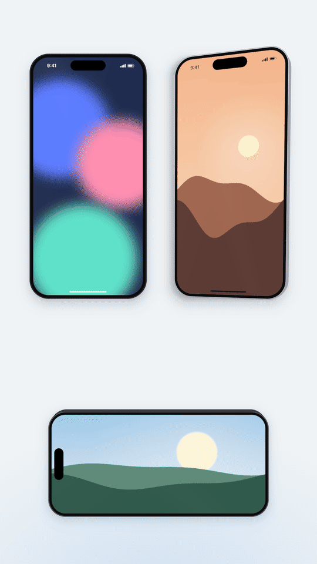

# The phone: `components/phone.ts`

A generic modern phone built for motion: flat-edged slab, thin metal ring, black bezel, camera pill, status bar, home indicator and a two-layer soft shadow, with the app's screens drawn into it. Every size comes from the outer width W through the ratios in `SKILL.md`, so one number sizes the whole device in any aspect.

Tested by rendering: compiled against `three` r185 with strict TypeScript, captured with the CLI at 1080 × 1920 (SwiftShader) in all three finishes, landscape, a 22° turn, a +30% push, punches, crossfades and veils. `images/device-finishes.png` shows the bare devices; `images/home.png` a populated screen.

It needs `PX` from `components/stage.ts` (`three-camera` `references/rig.md`) and `FONT` from `components/type.ts` (`three-type` `references/type-kit.md`). **Build it inside `withFonts`**: the status bar's time is type drawn once into a canvas.



Contents: 1 How it is built · 2 The module · 3 API · 4 A minimal scene · 5 Changing screens · 6 Beat moves · 7 Finishes, landscape, tilt, sizes · 8 When a frame comes out wrong

## 1. How it is built, and why

- **The body is one plane with a signed-distance shader.** Edge line, metal ring, bezel, screen and pill are nested rounded rectangles evaluated per pixel, each boundary antialiased with `fwidth`. So the corners are exactly concentric (screen radius = outer radius − bezel), the 2–3 px ring never stair-steps, and it stays crisp at any scale: a punch, a push, a 16:9 size. Geometry for a 2 px ring aliases; a canvas texture of the body goes soft when pushed.
- **The screen is a render target.** Everything in `ph.ui` (a `THREE.Scene` with its own orthographic camera, 1 unit = 100 px, origin at the screen centre) is drawn into a texture each frame, and the body shader shows it only inside the rounded screen. That clips sheets sliding off the bottom, cards peeking off the edge and pages pushing sideways, with no stencil buffer (the host's renderer has none) and no per-material clipping. Two render targets make crossfades exact: overlapping parts never double-expose.
- **The target is sized from the device**: screen px × the renderer's pixel ratio × `maxZoom`, 4× MSAA, half-float so dark gradients do not band. Canvas textures inside are drawn at `res` ≥ 2× that. Raise `maxZoom` before pushing into the screen.
- **Side walls** are an extruded rounded rectangle behind the face, invisible head-on and shown only when the device turns (`ph.device.rotation`).
- **The shadow** is two planes with a Gaussian rounded-box falloff (an erf approximation): a broad slate-blue drop and a tight contact shadow. They live on `ph.group`, not `ph.device`, so a tilt does not lift them off the ground.
- **The status bar belongs to the device**: drawn once in dark and light ink above every page, so it never changes between screens (the reference's signal bars came and went). The ink follows the first page in the render list with `userData.ink` (`appKit`'s `page()` sets it).

## 2. The module

```ts
import * as THREE from "three";
import { PX } from "./stage";
import { FONT } from "./type";

/** Every size of the device in composition px, derived from its outer width W (measured ratios). */
export interface PhoneSpec {
  W: number; H: number; R: number; // outer body and corner radius
  edge: number; rim: number; inset: number; // outer line, metal ring, total bezel to the screen
  Sw: number; Sh: number; Sr: number; // the screen (portrait: Sw < Sh)
  pillW: number; pillH: number; pillTop: number; // camera pill, its top below the screen top
  homeW: number; homeH: number; homeBottom: number; // home indicator, its bottom above the screen bottom
  statusY: number; timeX: number; iconsRight: number; timeSize: number; // status bar, from the screen's top-left
  landscape: boolean;
}

export function phoneSpec(W: number, landscape = false): PhoneSpec {
  const H = W * 2.09;
  const inset = W * 0.031;
  const sw = W - 2 * inset, sh = H - 2 * inset;
  return {
    W, H, R: W * 0.162, edge: Math.max(1, W * 0.003), rim: Math.max(1.5, W * 0.004), inset,
    Sw: landscape ? sh : sw, Sh: landscape ? sw : sh, Sr: W * 0.162 - inset,
    pillW: W * 0.3, pillH: W * 0.088, pillTop: W * 0.027,
    homeW: W * 0.32, homeH: Math.max(5, W * 0.01), homeBottom: W * 0.021,
    statusY: W * 0.071, timeX: W * 0.118, iconsRight: W * 0.078, timeSize: W * 0.039,
    landscape,
  };
}

export const FINISH = {
  black: { edge: "#18191f", rim: "#3b3b40", bezel: "#0b0b0b", side: "#1d1e23" },
  silver: { edge: "#8e9096", rim: "#dcdde2", bezel: "#0b0b0b", side: "#a4a6ad" },
  graphite: { edge: "#2a2c31", rim: "#6b6e75", bezel: "#0b0b0b", side: "#3a3c42" },
} as const;
export type Finish = { edge: string; rim: string; bezel: string; side: string };

export interface PhoneOptions {
  width?: number; // outer width W in composition px at scale 1 (765 = 83% of a 1920-tall frame)
  finish?: keyof typeof FINISH | Finish;
  landscape?: boolean;
  sheen?: number; // 0..1 glass highlight on the screen; 0 = none
  shadow?: number; // 0..1 multiplier on the two shadow layers
  maxZoom?: number; // the largest scale the phone is ever shown at (punch, push): sizes the screen texture
  depth?: number; // side thickness as a fraction of W, seen only when tilted
}

const VERT = /* glsl */ `
uniform vec2 uSize;
varying vec2 vP;
void main() {
  vP = (uv - 0.5) * uSize;
  gl_Position = projectionMatrix * modelViewMatrix * vec4(position, 1.0);
}`;

const SDF = /* glsl */ `
float sdRB(vec2 p, vec2 b, float r) {
  vec2 q = abs(p) - b + r;
  return length(max(q, 0.0)) + min(max(q.x, q.y), 0.0) - r;
}`;

const BODY = /* glsl */ `
uniform vec2 uSize;
uniform float uR, uEdge, uRim, uInset, uSr, uOpacity, uMix, uVeil, uSheen;
uniform vec4 uPill;
uniform vec3 uEdgeC, uRimC, uBezelC, uVeilC;
uniform sampler2D uA, uB;
varying vec2 vP;
${SDF}
void main() {
  vec2 hb = uSize * 0.5 - 1.0; // one px of room for the antialiased edge
  float d = sdRB(vP, hb, uR);
  float aa = max(fwidth(d), 1e-3) * 0.75;
  float ds = sdRB(vP, hb - uInset, uSr);
  float dp = sdRB(vP - uPill.xy, uPill.zw, min(uPill.z, uPill.w));
  // polished ring: lighter towards the top-left, darker at the bottom-right
  float light = dot(normalize(vP + vec2(0.001)), normalize(vec2(-0.55, 1.0)));
  vec3 rim = uRimC * (0.92 + 0.22 * light);
  vec3 col = uEdgeC;
  col = mix(col, rim, smoothstep(-aa, aa, -(d + uEdge)));
  col = mix(col, uBezelC, smoothstep(-aa, aa, -(d + uEdge + uRim)));
  vec2 uv = (vP + hb - uInset) / (2.0 * (hb - uInset));
  vec3 s = mix(texture2D(uA, uv).rgb, texture2D(uB, uv).rgb, uMix);
  s = mix(s, uVeilC, uVeil);
  // glass: a broad soft diagonal lift plus one faint band, both additive and small
  float diag = clamp(1.0 - (uv.x * 0.7 + (1.0 - uv.y) * 0.5), 0.0, 1.0);
  float band = exp(-pow((uv.x - (1.0 - uv.y) * 0.55 - 0.18) * 9.0, 2.0));
  s += uSheen * (0.03 * diag * diag + 0.012 * band);
  col = mix(col, s, smoothstep(-aa, aa, -ds));
  col = mix(col, vec3(0.0), smoothstep(-aa, aa, -dp));
  gl_FragColor = vec4(col, smoothstep(-aa, aa, -d) * uOpacity);
  #include <colorspace_fragment>
}`;

const SHADOW = /* glsl */ `
uniform vec2 uSize, uBox, uOff;
uniform float uR, uSigma, uOpacity;
uniform vec3 uColor;
varying vec2 vP;
${SDF}
float erf(float x) { float s = sign(x), a = abs(x); x = 1.0 + (0.278393 + (0.230389 + 0.078108 * (a * a)) * a) * a; x *= x; return s - s / (x * x); }
void main() {
  float d = sdRB(vP - uOff, uBox, uR);
  float a = 0.5 - 0.5 * erf(d / (uSigma * 1.4142));
  gl_FragColor = vec4(uColor, a * uOpacity);
  #include <colorspace_fragment>
}`;

function shapeRR(w: number, h: number, r: number): THREE.Shape {
  const s = new THREE.Shape();
  const x = -w / 2, y = -h / 2;
  s.moveTo(x + r, y);
  s.lineTo(x + w - r, y);
  s.absarc(x + w - r, y + r, r, -Math.PI / 2, 0, false);
  s.lineTo(x + w, y + h - r);
  s.absarc(x + w - r, y + h - r, r, 0, Math.PI / 2, false);
  s.lineTo(x + r, y + h);
  s.absarc(x + r, y + h - r, r, Math.PI / 2, Math.PI, false);
  s.lineTo(x, y + r);
  s.absarc(x + r, y + r, r, Math.PI, Math.PI * 1.5, false);
  return s;
}

/** Status bar (time, signal, battery) and home indicator for one ink, drawn once at the screen's size. */
function chrome(spec: PhoneSpec, ink: string, res: number, time: string): THREE.Mesh<THREE.PlaneGeometry, THREE.MeshBasicMaterial> {
  const { Sw, Sh, W } = spec;
  const canvas = new OffscreenCanvas(Math.ceil(Sw * res), Math.ceil(Sh * res));
  const g = canvas.getContext("2d")!;
  g.scale(res, res);
  g.fillStyle = ink;
  g.strokeStyle = ink;
  if (!spec.landscape) {
    const y = spec.statusY;
    g.font = `650 ${spec.timeSize}px ${FONT}`;
    g.textBaseline = "middle";
    g.fillText(time, spec.timeX, y + spec.timeSize * 0.04);
    const bw = W * 0.052, bh = W * 0.025, bx = Sw - spec.iconsRight - bw;
    g.globalAlpha = 0.4;
    g.lineWidth = Math.max(1.5, W * 0.002);
    g.beginPath();
    g.roundRect(bx, y - bh / 2, bw, bh, bh * 0.32);
    g.stroke();
    g.fillRect(bx + bw + W * 0.002, y - bh * 0.18, W * 0.003, bh * 0.36); // battery nub
    g.globalAlpha = 1;
    const ins = W * 0.0045;
    g.beginPath();
    g.roundRect(bx + ins, y - bh / 2 + ins, (bw - 2 * ins) * 0.86, bh - 2 * ins, (bh - 2 * ins) * 0.3);
    g.fill();
    const sw = W * 0.0085, gap = W * 0.004, sx = bx - W * 0.016 - 4 * sw - 3 * gap, sh = W * 0.029;
    for (let i = 0; i < 4; i++) {
      const h = sh * (0.4 + 0.2 * i);
      g.beginPath();
      g.roundRect(sx + i * (sw + gap), y + sh / 2 - h, sw, h, sw * 0.3);
      g.fill();
    }
  }
  g.beginPath();
  g.roundRect((Sw - spec.homeW) / 2, Sh - spec.homeBottom - spec.homeH, spec.homeW, spec.homeH, spec.homeH / 2);
  g.globalAlpha = ink === "#ffffff" ? 0.85 : 1;
  g.fill();
  const tex = new THREE.CanvasTexture(canvas as unknown as HTMLCanvasElement);
  tex.colorSpace = THREE.SRGBColorSpace;
  const m = new THREE.Mesh(new THREE.PlaneGeometry(Sw * PX, Sh * PX),
    new THREE.MeshBasicMaterial({ map: tex, transparent: true, depthWrite: false, toneMapped: false }));
  m.position.z = 4; // above every page, sheet and toast
  m.name = `status-${ink === "#ffffff" ? "light" : "dark"}`;
  return m;
}

export type Ink = "dark" | "light";

export interface Phone {
  group: THREE.Group; // move, scale and fade this: the whole device with its shadow
  device: THREE.Group; // tilt this (rotation.x / .y), not the group: the shadow stays on the ground
  spec: PhoneSpec;
  ui: THREE.Scene; // everything shown on the screen; origin = screen centre, 1 unit = 100 px
  /** Draw the screen. `a`: what is on it; `b` + `mix`: a crossfade towards b. Call once per frame, last. */
  render(a: THREE.Object3D | THREE.Object3D[], b?: THREE.Object3D | THREE.Object3D[], mix?: number): void;
  /** Per-frame look: whole-device opacity, a veil colour washed over the screen (flash, dim, "opening"). */
  set(o: { opacity?: number; veil?: number; veilColor?: THREE.ColorRepresentation; sheen?: number; status?: boolean }): void;
  /** A point on the device in px from its centre (y up), in the group's space. */
  at(xPx: number, yPx: number, z?: number): THREE.Vector3;
  /** Add a sticker or callout on top of the device at (x, y) px from its centre; it punches with the phone. */
  attach<O extends THREE.Object3D>(obj: O, xPx: number, yPx: number): O;
  dispose(): void;
}

/**
 * A generic modern phone: flat-edged slab, thin metal ring, black bezel, camera pill, status bar and
 * home indicator, a two-layer soft shadow. The screen is a render target: whatever is in `ui` is
 * drawn into it and clipped to the rounded screen by the body shader (crisp at any scale, no
 * stencil needed). Build it inside withFonts: the status bar's time is type.
 */
export function phone(ctx: { renderer: THREE.WebGLRenderer }, opts: PhoneOptions = {}, time = "9:41"): Phone {
  const landscape = opts.landscape ?? false;
  const spec = phoneSpec(opts.width ?? 765, landscape);
  const fin: Finish = typeof opts.finish === "object" ? opts.finish : FINISH[opts.finish ?? "black"];
  const { W, H } = spec;
  const bw = landscape ? H : W, bh = landscape ? W : H; // body size on screen
  const group = new THREE.Group();
  group.name = "phone";
  const device = new THREE.Group();
  device.name = "phone-device";
  group.add(device);

  // screen content: its own scene and an orthographic camera in PX units
  const ui = new THREE.Scene();
  ui.name = "phone-screen";
  const cam = new THREE.OrthographicCamera((-spec.Sw / 2) * PX, (spec.Sw / 2) * PX, (spec.Sh / 2) * PX, (-spec.Sh / 2) * PX, 0.1, 40);
  cam.position.z = 20;
  const pr = ctx.renderer.getPixelRatio() * Math.max(1, opts.maxZoom ?? 1.06);
  const mkRT = () => {
    const rt = new THREE.WebGLRenderTarget(Math.ceil(spec.Sw * pr), Math.ceil(spec.Sh * pr), {
      type: THREE.HalfFloatType, samples: 4, depthBuffer: false, generateMipmaps: false,
      minFilter: THREE.LinearFilter, magFilter: THREE.LinearFilter,
    });
    return rt;
  };
  const rtA = mkRT(), rtB = mkRT();
  const res = Math.max(2, pr * 1.5);
  const inkDark = chrome(spec, "#0d0f12", res, time);
  const inkLight = chrome(spec, "#ffffff", res, time);
  ui.add(inkDark, inkLight);

  // pill: portrait at the top centre; landscape on the left edge, turned
  const pc = landscape
    ? [-bw / 2 + spec.inset + spec.pillTop + spec.pillH / 2, 0, spec.pillH / 2, spec.pillW / 2]
    : [0, bh / 2 - spec.inset - spec.pillTop - spec.pillH / 2, spec.pillW / 2, spec.pillH / 2];
  const body = new THREE.ShaderMaterial({
    uniforms: {
      uSize: { value: new THREE.Vector2(bw, bh) },
      uR: { value: spec.R }, uEdge: { value: spec.edge }, uRim: { value: spec.rim },
      uInset: { value: spec.inset }, uSr: { value: spec.Sr },
      uPill: { value: new THREE.Vector4(...pc) },
      uEdgeC: { value: new THREE.Color(fin.edge) }, uRimC: { value: new THREE.Color(fin.rim) },
      uBezelC: { value: new THREE.Color(fin.bezel) },
      uA: { value: rtA.texture }, uB: { value: rtB.texture }, uMix: { value: 0 },
      uVeil: { value: 0 }, uVeilC: { value: new THREE.Color("#ffffff") },
      uSheen: { value: opts.sheen ?? 0.35 }, uOpacity: { value: 1 },
    },
    vertexShader: VERT, fragmentShader: BODY, transparent: true, depthWrite: false,
  });
  const face = new THREE.Mesh(new THREE.PlaneGeometry(bw * PX, bh * PX), body);
  face.name = "phone-face";
  face.renderOrder = 2;
  device.add(face);

  // side walls, seen only when the device is tilted
  const depth = (opts.depth ?? 0.1) * W;
  const sideMat = new THREE.MeshBasicMaterial({ color: fin.side, transparent: true, toneMapped: false });
  const side = new THREE.Mesh(new THREE.ExtrudeGeometry(shapeRR((bw - 2) * PX, (bh - 2) * PX, spec.R * PX), {
    depth: depth * PX, bevelEnabled: false, curveSegments: 24,
  }), sideMat);
  side.position.z = -depth * PX - 0.002;
  side.name = "phone-sides";
  side.renderOrder = 1;
  device.add(side);

  // two shadow layers: a broad slate-blue drop and a tight contact shadow
  const shadowK = opts.shadow ?? 1;
  const shadows = [
    { off: 0.04, sigma: 0.06, op: 0.22, color: "#1e2a3a" },
    { off: 0.012, sigma: 0.016, op: 0.16, color: "#141a24" },
  ].map((s, i) => {
    const pad = s.sigma * W * 3.5 + s.off * W;
    const sz = new THREE.Vector2(bw + pad * 2, bh + pad * 2);
    const m = new THREE.Mesh(new THREE.PlaneGeometry(sz.x * PX, sz.y * PX), new THREE.ShaderMaterial({
      uniforms: {
        uSize: { value: sz }, uBox: { value: new THREE.Vector2(bw / 2 - 2, bh / 2 - 2) },
        uOff: { value: new THREE.Vector2(0, -s.off * W) }, uR: { value: spec.R },
        uSigma: { value: s.sigma * W }, uOpacity: { value: s.op * shadowK }, uColor: { value: new THREE.Color(s.color) },
      },
      vertexShader: VERT, fragmentShader: SHADOW, transparent: true, depthWrite: false,
    }));
    m.position.z = -0.2 - i * 0.001;
    m.renderOrder = -1;
    m.name = `phone-shadow-${i + 1}`;
    m.userData.op = s.op * shadowK;
    group.add(m);
    return m;
  });

  let showStatus = !landscape;
  const asList = (x?: THREE.Object3D | THREE.Object3D[]) => (x ? (Array.isArray(x) ? x : [x]) : []);
  const draw = (list: THREE.Object3D[], rt: THREE.WebGLRenderTarget) => {
    const ink: Ink = (list.find((o) => o.userData.ink)?.userData.ink as Ink) ?? "dark";
    for (const c of ui.children) c.visible = list.includes(c);
    inkDark.visible = showStatus && ink === "dark";
    inkLight.visible = showStatus && ink === "light";
    if (landscape) inkDark.visible = inkLight.visible = false;
    ctx.renderer.setRenderTarget(rt);
    ctx.renderer.clear();
    ctx.renderer.render(ui, cam);
  };

  return {
    group, device, spec, ui,
    render(a, b, mix = 0) {
      const r = ctx.renderer;
      const prev = r.getRenderTarget();
      const clear = r.getClearColor(new THREE.Color());
      const alpha = r.getClearAlpha();
      r.setClearColor(0x000000, 0);
      draw(asList(a), rtA);
      const m = b ? Math.min(1, Math.max(0, mix)) : 0;
      if (m > 0) draw(asList(b), rtB);
      body.uniforms.uMix!.value = m;
      r.setRenderTarget(prev);
      r.setClearColor(clear, alpha);
    },
    set(o) {
      const u = body.uniforms;
      if (o.opacity !== undefined) {
        u.uOpacity!.value = o.opacity;
        sideMat.opacity = o.opacity;
        shadows.forEach((s) => ((s.material as THREE.ShaderMaterial).uniforms.uOpacity!.value = s.userData.op * o.opacity! ** 2));
        group.visible = o.opacity > 0.001;
      }
      if (o.veil !== undefined) u.uVeil!.value = o.veil;
      if (o.veilColor !== undefined) (u.uVeilC!.value as THREE.Color).set(o.veilColor);
      if (o.sheen !== undefined) u.uSheen!.value = o.sheen;
      if (o.status !== undefined) showStatus = o.status && !landscape;
    },
    at: (x, y, z = 0.05) => new THREE.Vector3(x * PX, y * PX, z),
    attach(obj, x, y) {
      obj.position.set(x * PX, y * PX, 0.3);
      obj.userData.rest = obj.position.clone();
      obj.traverse((o) => (o.renderOrder = 5)); // above the face (2), which is transparent too
      group.add(obj);
      return obj;
    },
    dispose() {
      rtA.dispose();
      rtB.dispose();
    },
  };
}

/**
 * The stage behind the phone: a flat cool ground with a soft glow rising from below the frame
 * (fades out by 75% of the height). Use as scene.background; it fills the frame in any aspect.
 */
export function stageBackdrop(width: number, height: number, ground = "#eff3f6", glow = "#cfe2f5"): THREE.CanvasTexture {
  const c = new OffscreenCanvas(Math.ceil(width / 2), Math.ceil(height / 2));
  const g = c.getContext("2d")!;
  g.scale(0.5, 0.5);
  g.fillStyle = ground;
  g.fillRect(0, 0, width, height);
  g.save();
  g.translate(width / 2, height * 1.07);
  g.scale(1, (height * 0.32) / (width * 0.83));
  const r = g.createRadialGradient(0, 0, 0, 0, 0, width * 0.83);
  r.addColorStop(0, glow);
  r.addColorStop(1, ground);
  g.fillStyle = r;
  g.fillRect(-width, -width * 3, width * 2, width * 6);
  g.restore();
  const t = new THREE.CanvasTexture(c as unknown as HTMLCanvasElement);
  t.colorSpace = THREE.SRGBColorSpace;
  return t;
}

/* ------------------------------------------------- the phone's beat moves */

/**
 * Beat punch: on each hit frame the device jumps +3.2% in ONE frame, then halves every frame
 * (+3.2, 1.6, 0.8, 0.4, 0.2%) and is at rest by frame 6. Measured on a 115 BPM launch film.
 */
export function punch(frame: number, hits: number[], amp = 0.032): number {
  let v = 0;
  for (const h of hits) {
    const k = frame - h;
    if (k >= 0 && k < 6) v = Math.max(v, amp * 0.5 ** k);
  }
  return v;
}

/**
 * Bar push: linear growth of `amount` over [start, end] (one bar), then a snap back to rest over
 * 5 frames (x0.6 per frame) at `end`, which lands on the next downbeat and doubles as an accent.
 */
export function creep(frame: number, start: number, end: number, amount = 0.039): number {
  if (frame < start) return 0;
  if (frame <= end) return (amount * (frame - start)) / Math.max(1, end - start);
  const k = frame - end; // 3.9, 2.1, 1.2, 0.6, 0.4, 0%: measured 795, 783, 775, 771, 767, 765
  return k < 5 ? amount * 0.55 ** k : 0;
}
```

## 3. API

| Call | Returns | Use |
| --- | --- | --- |
| `phoneSpec(W, landscape?)` | every size in px | Layout maths: `Sw`, `Sh` (screen), `R`, `inset`, pill and status positions |
| `phone(ctx, { width, finish, landscape, sheen, shadow, maxZoom, depth }, time?)` | `Phone` | The device. `width` is W at scale 1 (765 for 9:16); `finish` `"black"`, `"silver"`, `"graphite"` or `{ edge, rim, bezel, side }`; `sheen` 0–1 (0.35); `maxZoom` the largest scale it is ever shown at (1.06 covers punches and pushes) |
| `ph.group` | Group | Move, scale (punch, push, entrance) and fade the whole device with its shadow |
| `ph.device` | Group | Tilt only this: `rotation.y` up to about 0.4 rad (25°) still reads as a slab |
| `ph.ui` | Scene | Add pages, sheets and toast layers here; each top-level child is drawn only when listed in `render` |
| `ph.render(a, b?, mix?)` | — | **Last call of every frame.** Draws the listed objects into the screen; with `b` and `mix` it crossfades to a second list |
| `ph.set({ opacity, veil, veilColor, sheen, status })` | — | Whole-device fade (shadow fades with it), a colour washed over the screen (flash, "opening" veil), status bar on or off |
| `ph.attach(obj, x, y)` | obj | A sticker or callout on top of the device at (x, y) px from its centre; it punches and pushes with the phone |
| `ph.at(x, y)` | Vector3 | That point in the group's space |
| `stageBackdrop(width, height, ground?, glow?)` | texture | `scene.background`: the cool ground with the glow rising from below |
| `punch(frame, hits, amp?)` | number | Extra scale for beat punches |
| `creep(frame, start, end, amount?)` | number | Extra scale for the bar push and its snap back |

## 4. A minimal scene

```ts
import * as THREE from "three";
import type { ThreeSceneContext, ThreeSceneUpdate } from "@genmotion/three-engine";
import interUrl from "../assets/InterVariable.woff2";
import { fitCamera, PX } from "../components/stage";
import { withFonts } from "../components/type";
import { phone, punch, creep, stageBackdrop } from "../components/phone";
import { appKit } from "../components/appui";
import { beatGrid, rise } from "../components/flows";

export default function buildScene(ctx: ThreeSceneContext): ThreeSceneUpdate {
  fitCamera(ctx.camera, ctx.height);
  ctx.scene.background = stageBackdrop(ctx.width, ctx.height);
  return withFonts(ctx, [{ family: "Inter", url: interUrl }], () => {
    const ph = phone(ctx, { width: 765 });          // 9:16: 83% of the frame height
    ctx.scene.add(ph.group);
    const k = appKit(ph.spec);
    const home = k.page("home");
    k.put(home, k.navBar("Trails"), 0, 0);
    ph.ui.add(home);
    const grid = beatGrid(115, ctx.fps, 12);
    return ({ frame }) => {
      const zoom = 1 + Math.max(punch(frame, [grid.bar(1)]), creep(frame, grid.bar(0), grid.bar(1)));
      ph.group.scale.setScalar(zoom);
      ph.group.position.y = rise(frame, 0) * PX;
      ph.render(home);                               // last
    };
  });
}
```

## 5. Changing screens

Every top-level child of `ph.ui` is drawn only when it is in the list passed to `render`, so the list *is* the state: `[home]`, then `[home, sheet.group]`, then `[home, toastLayer]`. Choose by list; never hide a page with `fade()` on its group, which would overwrite the opacities its own parts animate.

- **Cut** (the default, on a downbeat, with a punch): change the list.
- **Crossfade** (6–8f): `ph.render(a, b, prog(frame, at, 8, inOutCubic))`. Two targets, so no double exposure.
- **Push** (12–16f inOutCubic): both pages in one list, the incoming one at a higher z (`b.position.z = 0.5`), `a.position.x = x0 − 0.3 · Sw · PX · p`, `b.position.x = x0 + (1 − p) · Sw · PX`.
- **"Opening" a page** (the reference's detail open): wash the old screen to near-white over 6f with `ph.set({ veil: p, veilColor: "#f7f8fa" })`, cut, then lift a `#555555` veil from 0.85 to 0 over 8f on the new page.
- **Sheet**: a sheet group in the list from its in-frame to its out-frame; `sheetPose` in `flows.ts` slides its panel.
- **Scroll** (10f inOutCubic, about 25% of the screen height): move one content group inside the page, and put `k.scrollEdge()` over it so nothing scrolls under the status bar.

All of these were rendered in a test scene (push, wash and veil, crossfade, scroll) and checked frame by frame.

## 6. Beat moves

```ts
// the device's scale this frame: rest 1, punches on the downbeats where the UI changes,
// a slow push through each held bar that snaps back on the next downbeat
const zoom = 1 + Math.max(punch(frame, [grid.bar(1), grid.bar(2)]), creep(frame, grid.bar(0), grid.bar(1)));
ph.group.scale.setScalar(zoom * entranceScale);
```

`punch` gives +3.2% on the hit frame, halving every frame, 0 by +6 (measured: 765 → 789/791 → 778 → 772 → 769 → 767 → 765). `creep` grows linearly to +3.9% over the bar and decays ×0.55 per frame for 5 frames after it (measured: 795, 783, 775, 771, 767, 765). Take the larger of the two, never the sum, or a punch on a snap reaches +7%. Scale `ph.group`, anchored at the device centre; the stage stays still.

## 7. Finishes, landscape, tilt, sizes

- `finish: "silver"` or `"graphite"` change only the ring, edge and sides; the bezel stays black, as on real devices.
- `landscape: true` turns the body (pill on the left edge), swaps `Sw`/`Sh`, and hides the status bar (as phones do in landscape video).
- A turn: `ph.device.rotation.set(0.06, -0.38, 0)` shows the side wall; keep it to one shot and ≤ 25°, the face is flat.
- Off-centre (a 16:9 layout with the phone on a third), the perspective camera shows a sliver of the near side wall, which reads as thickness; pass `depth: 0` for a perfectly flat slab. Tested at 1920 × 1080 with W = 430 at x = +400 px.
- At W below about 700 the status bar's time falls under 28 px: it is device chrome, not copy, and is exempt from the floor; everything the viewer must read is not.
- Per aspect, pick W from the table in `SKILL.md`; two phones side by side at W = 400 each fit a 1080-wide frame with 80 px between them.
- `sheen: 0` for the reference's perfectly flat glass; 0.35 adds a faint diagonal lift that reads as glass on light screens. Above 0.5 it shows as a streak on saturated colours.

## 8. When a frame comes out wrong

| Symptom | Cause | Fix |
| --- | --- | --- |
| Screen black or stale | `ph.render` not called, or called before the poses | Call it last in the update, every frame |
| A page or sheet missing | Not in the render list | The list is the state |
| A sticker hidden behind the phone | Added to the group without an order | `ph.attach(obj, x, y)` (renderOrder above the face) |
| Text soft at the end of a push | Target or canvases sized for 1× | `maxZoom` and `appKit(..., { res: 2 × maxZoom })` |
| Status bar in the wrong ink | No `userData.ink` on the first page in the list | `k.page(name, bg, "light")` for dark pages |
| Typing reveals the whole word | `set()` called before the input was placed | Call `input.set()` per frame, after `put()` |
| Two sheets or pages flicker in order | Equal z | The upper one at a higher z (sheets at 1, toast layers at 3) |
