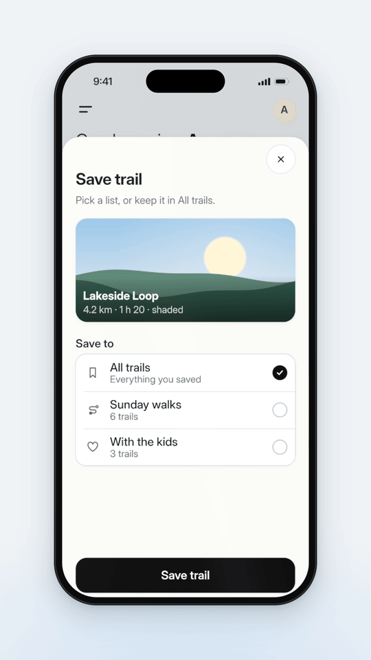
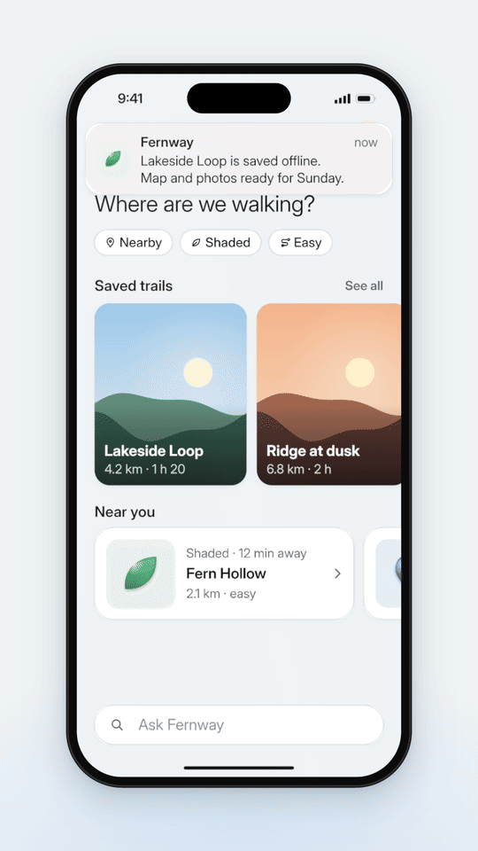
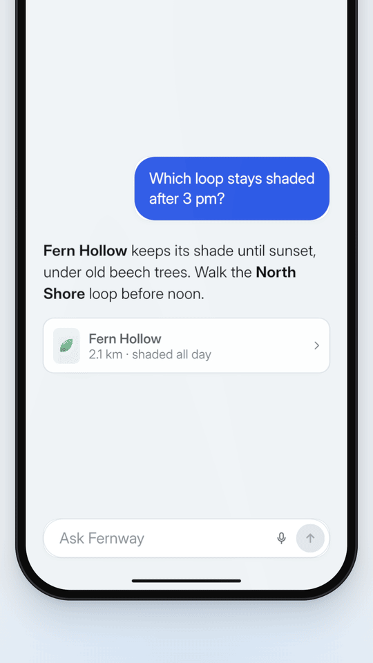
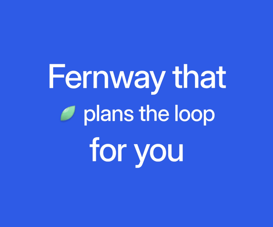

# Screen flows: `components/flows.ts` and the recipes

Every move a phone-led film makes, as closed-form functions of the frame (so any frame renders alone), timed from the measured reference and snapped to a beat grid. Then four complete, rendered scenes: the 6 s demo (phone rises, home builds, a sheet slides up, a radio fills, the button goes idle → loading → success, a sticker pops, the sheet leaves, a toast drops), a chat turn, a chapter card and a title card.

Tested by rendering: everything here compiled against `three` r185 with strict TypeScript and was captured with the CLI at 1080 × 1920 (SwiftShader); the demo was rendered to MP4. `images/sheet-rising.png`, `images/toast.png`, `images/chat.png` and `images/chapter-card.png` are frames from these scenes.

It needs `components/ease.ts` (`three-camera`), `components/type.ts` (`three-type`) and `components/appui.ts` (`fade`).

Contents: 1 The beat grid · 2 The module · 3 Timing table · 4 The 6 s demo · 5 A chat turn · 6 Stickers · 7 Chapter card · 8 Title card

## 1. The beat grid

The reference runs at about 115 BPM: a beat is 0.5225 s (**15.65f** at 30 fps), a bar **62.6f** (2.09 s). After the first drop every cut lands on a bar downbeat, without exception; inside a shot, words reveal on half-beats, the punch hits the downbeat, and button states change about a beat apart. Its cuts sit 2–3 frames after the fitted onset, which reads as "cut after the transient"; place yours on the grid and nudge by 2f only if the cut feels early against the music.

```ts
const grid = beatGrid(115, fps, 12);        // first downbeat at frame 12 (after the phone has risen)
grid.bar(1);   // 75: the sheet arrives, with a punch
grid.beat(5);  // 90: the radio fills
grid.bar(2);   // 137: the button lands on success, with a punch
```

Take the tempo from the music (`sound-design`), or pick 110–120 BPM for this energy. With no music, keep the grid anyway: the rhythm is visual.

## 2. The module

```ts
import * as THREE from "three";
import { PX } from "./stage";
import { clamp01, inCubic, inOutSine, lerp, outCubic, prog } from "./ease";
import type { Label } from "./type";
import { fade } from "./appui";

/** easeOutExpo: the phone's rise and the sheet's slide (per-frame travel roughly halves). */
export const outExpo = (t: number) => (t >= 1 ? 1 : 1 - 2 ** (-10 * t));

/** The film's beat grid in frames. Cut and punch on `bar(n)`, change UI state on `beat(n)`. */
export function beatGrid(bpm: number, fps: number, firstDownbeat = 0) {
  const beatF = (60 / bpm) * fps;
  return {
    beatF,
    barF: beatF * 4,
    beat: (n: number) => Math.round(firstDownbeat + n * beatF),
    bar: (n: number) => Math.round(firstDownbeat + n * 4 * beatF),
  };
}

/** Phone rising into frame: y offset in px (negative = below rest), 12f outExpo, opaque throughout. */
export const rise = (frame: number, start: number, fromPx = 840, dur = 12) => -fromPx * (1 - outExpo(clamp01((frame - start) / dur)));

/** Phone arriving after a cut: scale 0.85 -> 1 and opacity 0.25 -> 1 over 9f outCubic. */
export function scaleIn(frame: number, start: number, dur = 9) {
  const p = prog(frame, start, dur, outCubic);
  return { scale: lerp(0.85, 1, p), opacity: lerp(0.25, 1, p) };
}

/** Restore a component to its put() pose, then offset it by (dx, dy) px. */
const offset = (o: THREE.Object3D, dx: number, dy: number) => {
  const r = o.userData.rest as THREE.Vector3 | undefined;
  if (r) o.position.set(r.x + dx * PX, r.y - dy * PX, r.z);
};

/**
 * Bottom sheet in and out: its top slides from the screen bottom to `sheet.top` in 11f outExpo (no
 * overshoot), and back down off-screen in 8f inCubic. Returns whether to draw it this frame.
 */
export function sheetPose(
  sheet: { panel: THREE.Object3D; scrim: THREE.Object3D; top: number },
  screenH: number, frame: number, inAt: number, outAt = Infinity, o: { inDur?: number; outDur?: number; scrim?: number } = {},
): boolean {
  const pin = prog(frame, inAt, o.inDur ?? 11, outExpo);
  const pout = prog(frame, outAt, o.outDur ?? 8, inCubic);
  const top = lerp(lerp(screenH, sheet.top, pin), screenH + 40, pout);
  sheet.panel.position.y = -top * PX;
  fade(sheet.scrim, (o.scrim ?? 0) * pin * (1 - pout));
  return frame >= inAt && pout < 1;
}

/**
 * The three-state button, measured: press squeezes 3f and releases 4f; the label swaps to the
 * spinner over 3f from the bottom of the press; the spinner holds 14f (0.47 s); the colour ramps to
 * success over 4f. Returns the frame the success state lands (sync the title and a sticker to it).
 */
export function buttonPose(btn: { set: (s: { press?: number; loading?: number; done?: number; spin?: number }) => void }, frame: number, tap: number, hold = 14) {
  const press = frame < tap + 3 ? prog(frame, tap, 3, outCubic) : 1 - prog(frame, tap + 3, 4, outCubic);
  const loadAt = tap + 3, doneAt = loadAt + hold;
  btn.set({
    press,
    loading: prog(frame, loadAt, 3),
    done: prog(frame, doneAt, 4, inOutSine),
    spin: Math.max(0, frame - loadAt) * ((Math.PI * 2) / 20), // one turn per 20f
  });
  return doneAt + 4;
}

/** Banner toast: drops 40 px and fades in over 4f outCubic, holds, then fades out over 6f. */
export function toastPose(t: THREE.Object3D, frame: number, at: number, hold = 30, out = 6) {
  const pin = prog(frame, at, 4, outCubic);
  const pout = prog(frame, at + 4 + hold, out);
  offset(t, 0, -40 * (1 - pin));
  fade(t, pin * (1 - pout));
  return frame >= at && pout < 1;
}

/** Pill toast or sticker-like pop: scale 0.9 -> 1 and fade in over 4f outCubic. */
export function popIn(o: THREE.Object3D, frame: number, at: number, from = 0.9, dur = 4) {
  const p = prog(frame, at, dur, outCubic);
  o.scale.setScalar(lerp(from, 1, p));
  fade(o, p);
}

/** Characters typed by `frame`: linear at `cps` from `start`, finishing with the last character. */
export const typed = (frame: number, start: number, cps: number, fps: number) => Math.max(0, ((frame - start) * cps) / fps);

/**
 * Stream an answer word by word at `wps` words per second (5 reads; the measured 290 chars/s did
 * not): each word fades in over 4f and rises 6 px. Returns the frame the last word lands.
 */
export function streamPose(words: Label[], frame: number, start: number, wps: number, fps: number) {
  words.forEach((w, i) => {
    const at = start + Math.round((i * fps) / wps);
    const p = prog(frame, at, 4, outCubic);
    offset(w, 0, 6 * (1 - p));
    fade(w, p);
  });
  return start + Math.round(((words.length - 1) * fps) / wps) + 4;
}

/** Stagger a column of blocks: each fades in over `dur` and rises `risePx`, `step` frames apart. */
export function staggerIn(items: THREE.Object3D[], frame: number, start: number, step = 4, dur = 8, risePx = 20, scaleFrom = 1) {
  items.forEach((it, i) => {
    const p = prog(frame, start + i * step, dur, outCubic);
    offset(it, 0, risePx * (1 - p));
    if (scaleFrom !== 1) it.scale.setScalar(lerp(scaleFrom, 1, p));
    fade(it, p);
  });
}

/** The sent chat bubble: appears `fromPx` below its slot (where the empty state was) and glides up in 9f outCubic. */
export function bubbleGlide(b: THREE.Object3D, frame: number, at: number, fromPx = 460) {
  const p = prog(frame, at, 9, outCubic);
  offset(b, 0, fromPx * (1 - p));
  fade(b, prog(frame, at, 3));
}

/**
 * A sticker beside the device: pops 0 -> 1.08 in 4f from just inside the device edge (travelling out
 * and up from `-30deg`), settles to 1 in 3f, then unwinds 15 deg over 39f and bobs 4 px. `dir` = +1
 * on the right edge, -1 on the left.
 */
export function stickerPose(s: THREE.Object3D, frame: number, at: number, fps: number, dir = 1) {
  const k = frame - at;
  const scale = k < 0 ? 0 : k < 4 ? lerp(0, 1.08, outCubic(k / 4)) : lerp(1.08, 1, prog(frame, at + 4, 3, inOutSine));
  const travel = 1 - prog(frame, at, 4, outCubic);
  const size = (s.userData.wPx as number) ?? 150;
  offset(s, -dir * size * 0.35 * travel, size * 0.2 * travel - 4 * Math.sin((2 * Math.PI * 0.35 * Math.max(0, k)) / fps));
  s.rotation.z = THREE.MathUtils.degToRad(dir * lerp(-30, -15, prog(frame, at + 4, 39, inOutSine)));
  s.scale.setScalar(scale);
  s.visible = k >= 0;
}

/**
 * Word-by-word build for a type-kit line() made with align "left": each word appears at its frame
 * in `times` at full opacity `risePx` low and rises over 5f; the line re-centres over 7f each time.
 */
export function wordBuild(l: { group: THREE.Group; words: Label[] }, frame: number, times: number[], risePx = 35) {
  const centre = (i: number) => -((l.words[i]!.userData.restX as number) + (l.words[i]!.userData.w as number)) / 2;
  let x = centre(0);
  l.words.forEach((w, i) => {
    const t = times[i] ?? Infinity;
    w.position.y = -risePx * PX * (1 - prog(frame, t, 5, outCubic));
    fade(w, frame >= t ? 1 : 0);
    if (i > 0) x += (centre(i) - centre(i - 1)) * prog(frame, t, 7, outCubic);
  });
  l.group.position.x = x;
}

/** Vertical re-centring of a block whose lines arrive at `times`: the y offset (world units) of the block. */
export function blockGlide(frame: number, times: number[], pitchesPx: number[]) {
  let y = 0;
  for (let i = 1; i < times.length; i++) y += ((pitchesPx[i - 1] ?? 0) / 2) * PX * prog(frame, times[i]!, 7, outCubic);
  return y;
}
```

## 3. Timing table (30 fps)

| Event | Call | Frames from its start | Lands on |
| --- | --- | --- | --- |
| Phone first entry | `rise(frame, start)` | 0–12, outExpo, 840 px | Ends on the first downbeat |
| Phone after a cut | `scaleIn(frame, cut)` | 0–9, 0.85 → 1, 25% → 100% | The cut is on a downbeat |
| Home build | `staggerIn(blocks, frame, 6, 2, 8, 20)` | a block every 2–4f, 8f each, 20 px rise | Starts as the rise settles |
| Beat punch | `punch(frame, hits)` | +3.2%, halving, 0 by +6 | Downbeats where the UI changes |
| Bar push | `creep(frame, barStart, barEnd)` | +3.9% linear, snap back 5f | Every held bar |
| Sheet up / down | `sheetPose(sh, Sh, frame, in, out)` | up 11f outExpo; down 8f inCubic | Up on a downbeat; down on a beat, so the next thing lands one beat later |
| Radio fill | `fade(on, prog(frame, beat, 3))` | 3f | A beat |
| Button | `buttonPose(btn, frame, tap)` | press 0–3, release 3–7, spinner from 3, holds 14, success 17–21 | Choose `tap = bar − 21` so success lands on the downbeat, with a punch |
| Sheet title swap | `fade(title[i], …)` | 3f crossfades at the spinner and at success | With the button |
| Sticker | `stickerPose(st, frame, doneAt, fps)` | pop 0–4, settle 4–7, unwind 4–43 | The success frame |
| Toast | `toastPose(t, frame, at, hold)` | in 0–4, hold 30–40, out 6 | One frame after the sheet clears |
| Pill toast | `popIn(t, frame, at)` | 0.9 → 1 over 4f | With the drop that caused it |
| Typing | `input.set(typed(frame, start, 28, fps))` | 28 characters/s | Ends ≥ 4f before the send, on a beat |
| Send | `bubbleGlide(b, frame, send + 3)` | empty state out 6f; bubble glides 9f | The send on a beat |
| Status line | `fade(status, …)` | 15f | |
| Stream | `streamPose(words, frame, start, 5, fps)` | a word every 6f, 4f fade | Returns the last word's frame |
| After the answer | `staggerIn(rows, frame, last + 2, 3, 6, 12)` | rows 3f apart, follow-ups 5f | |

## 4. The 6 s demo (tested)

1080 × 1920, 180 frames. Every UI change is on the grid: the sheet on bar 1 with a punch, the radio on beat 5, success on bar 2 with a punch and the sticker, the sheet out on beat 9, the toast one frame after it clears. The stage stays still; only the phone moves. The sticker sits on the device's right edge beside empty sheet space, never over a control. `images/sheet-rising.png` is frame 80, `images/toast.png` frame 175.

 

```ts
import * as THREE from "three";
import type { ThreeSceneContext, ThreeSceneUpdate } from "@genmotion/three-engine";
import interUrl from "../assets/InterVariable.woff2";
import { fitCamera, PX } from "../components/stage";
import { prog, outCubic } from "../components/ease";
import { withFonts } from "../components/type";
import { phone, punch, creep, stageBackdrop } from "../components/phone";
import { appKit, fade, scenery, tile, sticker, APP_LIGHT } from "../components/appui";
import { beatGrid, rise, staggerIn, sheetPose, buttonPose, toastPose, stickerPose } from "../components/flows";

export default function buildScene(ctx: ThreeSceneContext): ThreeSceneUpdate {
  const { scene, camera, width, height, fps } = ctx;
  fitCamera(camera, height);
  scene.background = stageBackdrop(width, height);
  return withFonts(ctx, [{ family: "Inter", url: interUrl }], () => {
    const ph = phone(ctx, { width: 765 });
    scene.add(ph.group);
    const k = appKit(ph.spec);
    const { pad } = k.sp;
    const T = k.T;
    const lake = scenery(["#9cc7e8", "#e8eef0"], "#fff6d8", ["#5f8a7a", "#2f5a4c"]);
    const dusk = scenery(["#f3b48b", "#f7dcc0"], "#fff1c9", ["#a0664f", "#5b3a33"]);
    const fern = tile(T.tiles[4]!, "leaf", "#3fa36b");

    // home: fills the screen top to bottom (no empty lower half)
    const home = k.page("home");
    const blocks: THREE.Object3D[] = [];
    const add = (o: THREE.Object3D, x: number, y: number) => (blocks.push(k.put(home, o, x, y)), o);
    add(k.navBar(null, "menu", "A"), 0, 0);
    add(k.greeting(["Good morning, **Ana**.", "Where are we walking?"]), pad, k.pct(27));
    k.chipRow(home, [{ label: "Nearby", icon: "pin" }, { label: "Shaded", icon: "leaf" }, { label: "Easy", icon: "route" }], pad, k.pct(48)).forEach((c) => blocks.push(c));
    add(k.section("Saved trails", "See all"), pad, k.pct(61.5));
    const cw = Math.round(k.S * 0.47), ch = Math.round(k.S * 0.56);
    add(k.imageCard(cw, ch, lake, "Lakeside Loop", "4.2 km · 1 h 20"), pad, k.pct(70.5));
    add(k.imageCard(cw, ch, dusk, "Ridge at dusk", "6.8 km · 2 h"), pad + cw + k.pct(3.1), k.pct(70.5));
    add(k.section("Near you"), pad, k.pct(131));
    add(k.rowCard(Math.round(k.S * 0.8), fern, "Shaded · 12 min away", "Fern Hollow", "2.1 km · easy"), pad, k.pct(139.5));
    add(k.rowCard(Math.round(k.S * 0.8), tile(T.tiles[0]!, "pin", "#4f7be8"), "Lake · 20 min", "North Shore", "3.4 km"), pad + Math.round(k.S * 0.8) + k.pct(3.1), k.pct(139.5));
    const ask = k.input(k.Sw - pad * 2, "Ask Fernway", "", { icon: "search" });
    add(ask.group, pad, k.Sh - ask.height - k.pct(10));
    ph.ui.add(home);

    // save sheet
    const sh = k.sheet(Math.round(k.Sh * 0.1), { close: true });
    const titles = ["Save trail", "Saving", "Saved to Sunday walks"].map((s) => k.put(sh.panel, k.textBlock(s, k.type.sheet, 700), pad, k.pct(13)));
    const subs = ["Pick a list, or keep it in All trails.", "Downloading the map for offline use.", "Ready offline. Open it from your lists."].map((s) => k.put(sh.panel, k.textBlock(s, k.type.sub, 400, T.muted), pad, k.pct(23)));
    k.put(sh.panel, k.imageCard(k.Sw - pad * 2, Math.round(k.S * 0.42), lake, "Lakeside Loop", "4.2 km · 1 h 20 · shaded"), pad, k.pct(33));
    k.put(sh.panel, k.section("Save to"), pad, k.pct(80));
    const list = k.listGroup(k.Sw - pad * 2, [
      { title: "All trails", sub: "Everything you saved", icon: "bookmark", control: "radio" },
      { title: "Sunday walks", sub: "6 trails", icon: "route", control: "radio" },
      { title: "With the kids", sub: "3 trails", icon: "heart", control: "radio" },
    ]);
    k.put(sh.panel, list.group, pad, k.pct(88));
    const btn = k.stateButton(k.Sw - pad * 2, { idle: "Save trail", loading: "Saving…", done: "Saved" });
    k.put(sh.panel, btn.group, pad, k.Sh * 0.9 - k.pct(10) - btn.height);
    ph.ui.add(sh.group);

    // toast layer above everything on the screen
    const top = new THREE.Group();
    top.position.set((-k.Sw / 2) * PX, (k.Sh / 2) * PX, 3);
    const toast = k.put(top, k.toast("Fernway", ["Lakeside Loop is saved offline.", "Map and photos ready for Sunday."], fern), k.pct(2.7), k.pct(15));
    ph.ui.add(top);

    // a sticker on the device's right edge, beside empty sheet space (never over live UI)
    const st = sticker("ribbon", Math.round(ph.spec.W * 0.2), "#3fa36b");
    ph.attach(st, ph.spec.W / 2 + 18, -470);

    const grid = beatGrid(115, fps, 12); // bars at 12, 75, 137, 200
    const SHEET = grid.bar(1), TAP = grid.bar(2) - 3 - 14 - 4, OUT = grid.beat(9), TOAST = OUT + 9;
    return ({ frame }) => {
      // the device: rises, pushes slowly through each bar, punches on the downbeats that change the UI
      const zoom = 1 + Math.max(punch(frame, [SHEET, grid.bar(2)]), creep(frame, grid.bar(0), SHEET), creep(frame, SHEET, grid.bar(2)), creep(frame, grid.bar(2), grid.bar(3)));
      ph.group.scale.setScalar(zoom);
      ph.group.position.y = rise(frame, 0) * PX;

      staggerIn(blocks, frame, 6, 2, 8, 20);
      const showSheet = sheetPose(sh, k.Sh, frame, SHEET, OUT, { scrim: 1 });
      const fill = prog(frame, grid.beat(5), 3);
      fade(list.controls[0]!.on, 1);
      fade(list.controls[0]!.off, 0);
      fade(list.controls[1]!.on, fill);
      fade(list.controls[1]!.off, 1 - fill);
      fade(list.controls[2]!.on, 0);
      const doneAt = buttonPose(btn, frame, TAP);
      const t1 = prog(frame, TAP + 3, 3), t2 = prog(frame, doneAt - 4, 4);
      [1 - t1, t1 * (1 - t2), t2].forEach((o, i) => (fade(titles[i]!, o), fade(subs[i]!, o)));
      stickerPose(st, frame, doneAt, fps);
      if (frame >= OUT) st.scale.multiplyScalar(1 - prog(frame, OUT, 6, outCubic));
      const showToast = toastPose(toast, frame, TOAST, 40);

      ph.render([home, ...(showSheet ? [sh.group] : []), ...(showToast ? [top] : [])]);
    };
  });
}
```

## 5. A chat turn (tested)

The reference streamed its answer at 290 characters per second, so nobody could read it, and left the lower half of the screen empty before the answer. Here the composer types at 30 characters/s; the send clears the empty state; the bubble glides up; a status line holds 15f; the answer streams at 5 words/s while the phone pushes in 1.3× so its 34 px body reads at 44 px; result rows and follow-ups stagger in; the turn is stacked from the composer up, so it fills the lower half. `images/chat.png` is frame 190.



```ts
import * as THREE from "three";
import type { ThreeSceneContext, ThreeSceneUpdate } from "@genmotion/three-engine";
import interUrl from "../assets/InterVariable.woff2";
import { fitCamera, PX } from "../components/stage";
import { prog, inOutCubic, lerp } from "../components/ease";
import { withFonts } from "../components/type";
import { phone, stageBackdrop } from "../components/phone";
import { appKit, fade, scenery, sticker, tile } from "../components/appui";
import { typed, bubbleGlide, streamPose, staggerIn } from "../components/flows";

export default function buildScene(ctx: ThreeSceneContext): ThreeSceneUpdate {
  const { scene, camera, width, height, fps } = ctx;
  fitCamera(camera, height);
  scene.background = stageBackdrop(width, height);
  return withFonts(ctx, [{ family: "Inter", url: interUrl }], () => {
    const PUSH = 1.3; // the answer is the proof: push in so its body text reads at 34 x 1.3 = 44 px
    const ph = phone(ctx, { width: 765, maxZoom: PUSH });
    scene.add(ph.group);
    const k = appKit(ph.spec, undefined, { res: 2 * PUSH });
    const { pad } = k.sp;
    const page = k.page("chat");
    k.put(page, k.navBar(null, "back"), 0, 0);
    const name = k.chip("Fernway", "spark");
    k.put(page, name, (k.Sw - name.userData.wPx) / 2, k.pct(14.5));

    // empty state: one sticker, one line, quick prompts above the composer
    const empty = new THREE.Group();
    empty.position.set((-k.Sw / 2) * PX, (k.Sh / 2) * PX, 0);
    const icon = sticker("leaf", k.pct(24), "#3fa36b", k.res);
    k.put(empty, icon, (k.Sw - k.pct(24)) / 2, k.pct(70));
    k.put(empty, k.textBlock("Ask about any trail near you.", k.type.sub, 400, k.T.muted, k.Sw - pad * 2, "center"), pad, k.pct(100));
    const prompts = k.chipRow(empty, [{ label: "Shady loops", tint: "#e5ecfb" }, { label: "Under 5 km" }], pad, k.Sh - k.pct(37));
    const q = "Which loop stays shaded after 3 pm?";
    const composer = k.input(k.Sw - pad * 2, "Ask Fernway", q, { send: true });
    k.put(page, composer.group, pad, k.Sh - composer.height - k.pct(10));

    // the turn: bubble, a status line, the answer, result rows, follow-ups. Built bottom-up from the
    // composer, the way chat apps stack, so the conversation fills the lower half instead of leaving it empty.
    const turn = new THREE.Group();
    turn.position.copy(empty.position);
    const bubble = k.bubble(q);
    const ans = k.answer("**Fern Hollow** keeps its shade until sunset, under old beech trees. Walk the **North Shore** loop before noon.");
    const rw = k.Sw - pad * 2;
    const rowArt = [tile(k.T.tiles[4]!, "leaf", "#3fa36b"), scenery(["#9cc7e8", "#e8eef0"], "#fff6d8", ["#5f8a7a", "#2f5a4c"])];
    const rowsM = [k.resultRow(rw, rowArt[0]!, "Fern Hollow", "2.1 km · shaded all day"), k.resultRow(rw, rowArt[1]!, "North Shore", "3.4 km · shade until 2 pm")];
    const followM = ["Any with a waterfall?", "Which is easiest with kids?"].map((s) => k.followUp(s));
    const gap = k.pct(4), rowH = rowsM[0]!.userData.hPx as number, fH = followM[0]!.userData.hPx as number;
    const total = bubble.userData.hPx + gap * 1.5 + ans.height + gap + (rowH + k.pct(2.2)) * 2 + gap * 0.5 + fH * 2;
    let y = k.Sh - composer.height - k.pct(10) - gap - total;
    const top = y;
    k.put(turn, bubble, k.Sw - pad - bubble.userData.wPx, y);
    y += bubble.userData.hPx + gap * 1.5;
    const status = k.put(turn, k.textBlock("Checking trails…", k.type.sub, 400, k.T.muted), pad, y);
    k.put(turn, ans.group, pad, y);
    y += ans.height + gap;
    const rows = rowsM.map((r) => ((y += rowH + k.pct(2.2)), k.put(turn, r, pad, y - rowH - k.pct(2.2))));
    y += gap * 0.5;
    const follows = followM.map((f) => ((y += fH), k.put(turn, f, pad, y - fH)));
    const focus = (top + y) / 2; // the turn's centre, px from the screen top
    ph.ui.add(page, empty, turn);

    const SEND = 52, GLIDE = SEND + 3, STREAM = GLIDE + 24;
    return ({ frame }) => {
      composer.set(frame < SEND ? typed(frame, 8, 30, fps) : 0, frame < SEND, frame < SEND && frame >= 8);
      fade(empty, 1 - prog(frame, SEND, 6));
      bubbleGlide(bubble, frame, GLIDE);
      fade(status, prog(frame, GLIDE + 9, 3) * (1 - prog(frame, STREAM - 2, 3)));
      const last = streamPose(ans.words, frame, STREAM, 5, fps);
      staggerIn(rows, frame, last + 2, 3, 6, 12);
      staggerIn(follows, frame, last + 10, 5, 6, 10);
      // push in on the answer while it streams, ease back out once the follow-ups are in
      const p = prog(frame, STREAM - 6, 30, inOutCubic) * (1 - prog(frame, last + 40, 24, inOutCubic));
      ph.group.scale.setScalar(lerp(1, PUSH, p));
      ph.group.position.y = lerp(0, -(k.Sh / 2 - focus) * PUSH, p) * PX; // the turn's centre to the frame's centre
      // the turn is drawn from the send on (choose by list, not fade(): a parent's fade overwrites the words' own)
      ph.render([page, empty, ...(frame >= GLIDE ? [turn] : [])]);
    };
  });
}
```

Hold after the last word: at least `direction`'s hold formula for the answer's word count (18 words: 177f from its last word is the strict reading; a 2-bar shot after the stream is the practical one), or cut to a card that restates the claim.

## 6. Stickers

- **One per shot, matched to the content** (a ribbon on save, a bubble on a message, a spark on an AI answer, a leaf for an outdoors app), 0.20–0.23 W, drawn by `sticker()` (original geometry, glossy; never a copy of an emoji set).
- **Placement**: on the device's edge, overlapping it by at most the bezel plus the side padding (`ph.spec.inset + k.sp.pad`, about 0.08 W), beside empty space. `ph.attach(st, W / 2 + 18, y)` puts it on the right edge at `y` px from the device centre; it then punches and pushes with the phone.
- **Motion** (`stickerPose`): pop from scale 0 to 1.08 in 4f, starting at −30° and from just inside the device edge, travelling outward and up; settle to 1 in 3f; unwind 15° over 39f (inOutSine); bob ±4 px at 0.35 Hz. No exit: it leaves with the cut, or shrinks out over 6f when the UI it sits beside changes.
- **Openers and closers**: a cluster of 6 around a mark (1–2f apart, inner ring first, 0 → 1.1 → 1), or a burst of about 14 from the centre out to a ring over 6–8f (outBack) that then drifts outward and grows 2% during the hold. Place them from a fixed list of angles, never at random.

## 7. Chapter card (tested)

A full-bleed card in the app's accent, exactly one bar, a hard cut in on the downbeat with the first word already there. Three centred lines: L1 at about 130 px, L2 at 0.65 × (88 px) with an inline icon leading it, L3 at 130 px; pitch about 145 px; the block re-centres as lines arrive. Cadence after the cut: L1's second word +4, the icon +10, L2's words +13 / +16 / +19, L3 at +30 (the third beat), the rest holds. Out: the last 3 frames zoom to 1.15 and blur, then the cut to the phone, which scales in from 0.85. `images/chapter-card.png` is frame 40.

The shape is the reference's "[Product] that / [icon] [verb phrase] / for you": adapt it to the brief ("[Product] / [icon] [does the thing] / [for whom, or when]"), keep only the middle line changing between cards, and follow each card with the shot that proves its verb. A last card can swap only its middle line (and icon) once per beat, four times, to list four features in one bar.



```ts
import * as THREE from "three";
import type { ThreeSceneContext, ThreeSceneUpdate } from "@genmotion/three-engine";
import interUrl from "../assets/InterVariable.woff2";
import { fitCamera, PX } from "../components/stage";
import { prog, inCubic, lerp } from "../components/ease";
import { withFonts, line, setLabel, type TypeStyle } from "../components/type";
import { sticker, fade } from "../components/appui";
import { wordBuild, blockGlide, popIn } from "../components/flows";

/** Chapter card: "[Product] that / [icon] [verb phrase] / for you", one bar long, built on half-beats. */
export default function buildScene(ctx: ThreeSceneContext): ThreeSceneUpdate {
  const { scene, camera, durationInFrames: D } = ctx;
  fitCamera(camera, ctx.height);
  scene.background = new THREE.Color("#2e5be6"); // the app's accent: cards and UI read as one product
  return withFonts(ctx, [{ family: "Inter", url: interUrl }], () => {
    const big: TypeStyle = { size: 130, weight: 500, color: "#ffffff" };
    const mid: TypeStyle = { size: 88, weight: 500, color: "#ffffff" };
    const PITCH = 145;
    const block = new THREE.Group();
    scene.add(block);
    const l1 = line("Fernway that", big, "left");
    const l2 = line("plans the loop", mid, "left");
    const l3 = line("for you", big, "left");
    const icon = sticker("leaf", 78, "#7fd99f");
    const iconW = 78 + 22; // the icon leads line 2 and counts as its first "word"
    l2.words.forEach((w) => ((w.position.x += iconW * PX), (w.userData.restX += iconW * PX)));
    icon.position.set((78 / 2) * PX, 0, 0.01);
    l2.group.add(icon);
    [l1, l2, l3].forEach((l, i) => ((l.group.position.y = (1 - i) * PITCH * PX), block.add(l.group)));
    const t1 = [0, 4], t2 = [13, 16, 19], t3 = [30, 34]; // frames after the cut: half-beat cadence at 115 BPM
    return ({ frame }) => {
      wordBuild(l1, frame, t1);
      wordBuild(l2, frame, t2);
      popIn(icon, frame, 10, 0, 4);
      wordBuild(l3, frame, t3);
      block.position.y = (-PITCH * PX) + blockGlide(frame, [0, t2[0]!, t3[0]!], [PITCH, PITCH]);
      // out: the last 3 frames zoom 1.15 and blur out into the cut
      const out = prog(frame, D - 3, 3, inCubic);
      block.scale.setScalar(lerp(1, 1.15, out));
      for (const w of [...l1.words, ...l2.words, ...l3.words]) setLabel(w, { blur: 14 * out });
      if (out > 0) fade(block, 1 - out);
    };
  });
}
```

## 8. Title card (tested)

Before the phone: ink on the stage, the key phrase in the accent at the end of the sentence. One word every 8f (half a beat), each arriving opaque 35 px low and rising over 5f while the line re-centres over 7f; lines push the block up as they arrive. Out: in reading order, each word blurs 12 px and fades over 4f, 1f apart, drifting up 10 px. Display size 104–135 px at 1080 wide, block ≤ 67% of the frame width.

```ts
import * as THREE from "three";
import type { ThreeSceneContext, ThreeSceneUpdate } from "@genmotion/three-engine";
import interUrl from "../assets/InterVariable.woff2";
import { fitCamera, PX } from "../components/stage";
import { prog, inCubic } from "../components/ease";
import { withFonts, line, setLabel, type TypeStyle } from "../components/type";
import { stageBackdrop } from "../components/phone";
import { fade } from "../components/appui";
import { wordBuild, blockGlide } from "../components/flows";

/** Light title card: a word every 8f (half a beat at 115 BPM), payoff line in the accent, staggered blur-out. */
export default function buildScene(ctx: ThreeSceneContext): ThreeSceneUpdate {
  const { scene, camera, width, height, durationInFrames: D } = ctx;
  fitCamera(camera, height);
  scene.background = stageBackdrop(width, height);
  return withFonts(ctx, [{ family: "Inter", url: interUrl }], () => {
    const st: TypeStyle = { size: 120, weight: 500, color: "#0d0e0f" };
    const l1 = line("Every trail you saved,", { ...st, size: 104 }, "left");
    const l2 = line("ready offline.", { ...st, color: "#2e5be6" }, "left");
    const PITCH = 140;
    const block = new THREE.Group();
    l1.group.position.y = (PITCH / 2) * PX;
    l2.group.position.y = (-PITCH / 2) * PX;
    block.add(l1.group, l2.group);
    scene.add(block);
    const t1 = l1.words.map((_, i) => i * 8);
    const t2 = l2.words.map((_, i) => (l1.words.length + i) * 8);
    const all = [...l1.words, ...l2.words];
    const EXIT = D - 12;
    return ({ frame }) => {
      wordBuild(l1, frame, t1);
      wordBuild(l2, frame, t2);
      block.position.y = -(PITCH / 2) * PX + blockGlide(frame, [0, t2[0]!], [PITCH]);
      // exit in reading order: each word blurs and fades over 4f, 1f apart, drifting up 10 px
      all.forEach((w, i) => {
        const p = prog(frame, EXIT + i, 4, inCubic);
        if (p <= 0) return;
        setLabel(w, { blur: 12 * p });
        fade(w, 1 - p);
        w.position.y += 10 * PX * p;
      });
    };
  });
}
```
