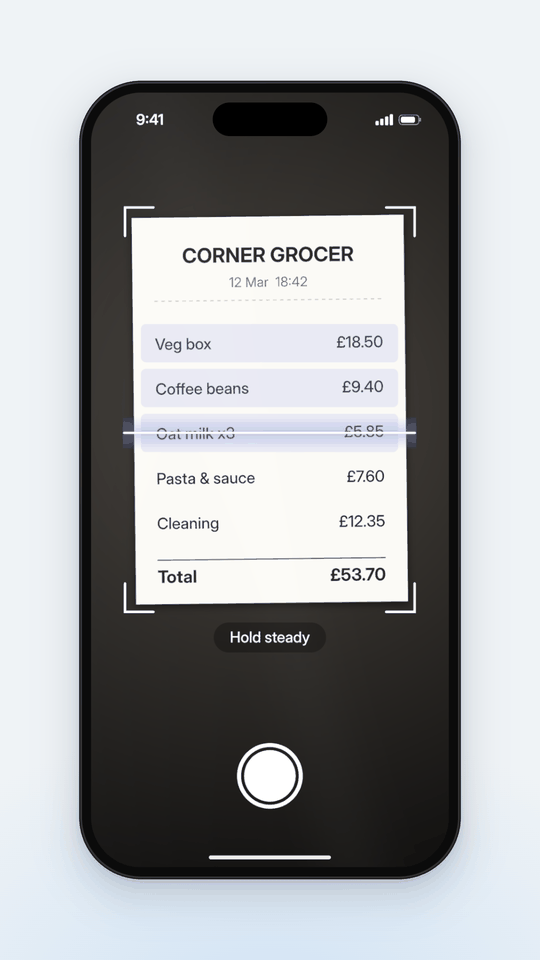

# More app parts: `components/appmore.ts`

The parts fewer films need, built on the kit from `references/ui-kit.md` with the same rules (drawn once, origin at the centre, `put()` places them): share-sheet rows, grouped actions, a chat turn, a library card, a detail hero, step lists, and a camera page that scans a document. Read this when the film has a chat, a share sheet, a library, a detail page or a "snap it" moment; skip it otherwise.

Tested by rendering: compiled with strict TypeScript against `three` r185 and captured at 1080 × 1920 inside the phone. `images/scanner.png` is §3's scene at frame 30, mid-scan; `images/chat.png` (in `references/screen-flows.md`) is the chat turn built from §1's parts.



Contents: 1 API · 2 Using it · 3 A scanner scene · 4 The module

## 1. API

| Call | Gives | Notes |
| --- | --- | --- |
| `moreKit(k)` | `m` | `k` from `appKit(...)` |
| `m.avatarRow(people)`, `m.actions(w, rows)` | plane | Share-sheet parts: 15% S circles on an 18.6% pitch with names; grouped action rows, text left and glyph right |
| `m.bubble(msg)` | plane | The user's chat bubble: accent pill, wraps past 66% of S; right-align it yourself |
| `m.answer(msg, w?)` | `{ group, words[], height }` | One label per word for `streamPose`; `**bold**` entity names |
| `m.resultRow(w, art, title, meta)`, `m.followUp(msg)` | plane | The answer's evidence and next questions |
| `m.collection(w, [a, b, c, d], name, count)` | plane | Library card: 2 × 2 mosaic, count, two-line name |
| `m.hero(art, height?)` | `{ group, card }` | Ambient blurred backdrop fading into the page, floating portrait card |
| `m.steps(items, numbered?)` | planes | Accent numbered dots (or spark glyphs), bold lead-in, one plane per item |
| `m.scanner(doc, rows, { aspect, hint })` | `{ page, set({ row, press }), rowY(i), shutter, doc }` | A dark camera page: the document lit in a frame, corner brackets, a scan line, a highlight on every row it has passed, a shutter. `set` per frame; `row` from `scanRow()` in `flows.ts` |
| `paper(heading, rows, total?)` | `Art` | A placeholder receipt or form: centred heading, name left / amount right on the rows the scanner marks (`docRow(i, n)`), a bold total |

## 2. Using it

- **Chat**: `references/screen-flows.md` §6 is a full turn (typing, send, bubble glide, status line, a streamed answer, result rows, follow-ups) using `m.bubble`, `m.answer`, `m.resultRow` and `m.followUp`.
- **Scanner**: the line lands on each row `perRow` frames apart (6–10f reads as "reading"; a 5-row receipt in 40f), every landing gets a short tonal blip (a soft tick or a glass "tink" a step up the scale per row; never a rising noise), then a touch on the shutter with a camera-shutter click, a white flash (`ph.set({ veil })` at 0.85, falling over 6f) and a punch. Then cut to what the scan produced: the rows, now data. The shutter sits low on the screen: in a 9:16 feed cut, push in so it is above frame y 1210, or let the scan finish on its own and skip the shutter.
- **Share sheet**: a `k.sheet` with `m.avatarRow` and an `m.actions` group; the check on the chosen person is a `k.listGroup` radio or a `k.pill`.
- **Detail**: `m.hero` at the top of a page, then `k.textBlock` title and `m.steps`; scroll it with `k.scrollEdge` over the content group.

## 3. A scanner scene

```ts
import type { ThreeSceneContext, ThreeSceneUpdate } from "@genmotion/three-engine";
import interUrl from "../assets/InterVariable.woff2";
import { fitCamera } from "../components/stage";
import { prog, outCubic } from "../components/ease";
import { withFonts } from "../components/type";
import { phone, punch, stageBackdrop } from "../components/phone";
import { appKit } from "../components/appui";
import { moreKit, paper } from "../components/appmore";
import { scanRow, tapPose } from "../components/flows";

/** Snap a receipt: the scan line lands on each row (a short tonal blip each), then the shutter (a click) and a flash. */
export default function buildScene(ctx: ThreeSceneContext): ThreeSceneUpdate {
  fitCamera(ctx.camera, ctx.height);
  ctx.scene.background = stageBackdrop(ctx.width, ctx.height);
  return withFonts(ctx, [{ family: "Inter", url: interUrl }], () => {
    const ph = phone(ctx, { width: 765 });
    ctx.scene.add(ph.group);
    const k = appKit(ph.spec);
    const m = moreKit(k);
    const items: [string, string][] = [["Veg box", "£18.50"], ["Coffee beans", "£9.40"], ["Oat milk x3", "£5.85"], ["Pasta & sauce", "£7.60"], ["Cleaning", "£12.35"]];
    const sc = m.scanner(paper("CORNER GROCER", items, ["Total", "£53.70"]), items.length, { hint: "Hold steady" });
    const tap = k.tapMark();
    k.put(sc.page, tap.group, sc.shutter.x - tap.group.userData.wPx / 2, sc.shutter.y - tap.group.userData.hPx / 2, 0.06);
    ph.ui.add(sc.page);
    const SCAN = 10, PER = 8, SHUTTER = SCAN + items.length * PER + 10;
    return ({ frame }) => {
      sc.set({ row: scanRow(frame, SCAN, items.length, PER), press: prog(frame, SHUTTER, 2, outCubic) * (1 - prog(frame, SHUTTER + 2, 4)) });
      tapPose(tap, frame, SHUTTER);
      ph.set({ veil: 0.85 * (1 - prog(frame, SHUTTER + 1, 6)) * (frame > SHUTTER ? 1 : 0), veilColor: "#ffffff" }); // the product's own flash
      ph.group.scale.setScalar(1 + punch(frame, [SHUTTER]));
      ph.render(sc.page);
    };
  });
}
```

## 4. The module

Copy it whole into `components/appmore.ts` next to `components/appui.ts`.

```ts
import * as THREE from "three";
import { PX } from "./stage";
import { label, measure } from "./type";
import { appKit, box, fade, fit, hex, icon, rgba, shade, text, wrap, type Art } from "./appui";

const TAU = Math.PI * 2;
type Kit = ReturnType<typeof appKit>;

/** Where row i of n sits down a scanned document, as a fraction of its height (paper() and scanner() share it). */
export const docRow = (i: number, n: number) => 0.27 + (0.58 * (i + 0.5)) / n;

/**
 * Placeholder document for a scanner: off-white paper with a centred heading, `rows` as name left /
 * amount right on the docRow() lines, and a bold total. Deterministic; it is art, drawn into the viewfinder.
 */
export const paper = (heading: string, rows: [string, string][], total?: [string, string]): Art => (g, w, h) => {
  g.fillStyle = "#fbfaf6";
  g.fillRect(0, 0, w, h);
  const ink = "#2b2825", size = w * 0.058;
  text(g, heading, w / 2, h * 0.1, w * 0.075, 700, ink, "center");
  text(g, "12 Mar  18:42", w / 2, h * 0.17, size * 0.85, 400, "#77716a", "center");
  g.fillStyle = "#cfc9c0";
  for (let x = w * 0.08; x < w * 0.92; x += 14) g.fillRect(x, h * 0.215, 7, 2); // dashed rule
  rows.forEach(([name, amt], i) => {
    const y = h * docRow(i, rows.length);
    text(g, name, w * 0.08, y, size, 500, ink);
    text(g, amt, w * 0.92, y, size, 500, ink, "right");
  });
  if (total) {
    g.fillRect(w * 0.08, h * 0.885, w * 0.84, 2);
    text(g, total[0], w * 0.08, h * 0.93, size * 1.1, 700, ink);
    text(g, total[1], w * 0.92, h * 0.93, size * 1.1, 700, ink, "right");
  }
};

/**
 * The less common parts of an app film, built on a kit from appKit(): share-sheet rows, grouped actions,
 * a chat turn (bubble, streamed answer, result rows, follow-ups), a library card, a detail hero, step
 * lists and a camera scanner. Same rules as the kit: drawn once, origin at the centre, put() places them.
 */
export function moreKit(k: Kit) {
  const { S, Sw, Sh, T, type, sp, pct, plane, card, roundPath, hairline } = k;
  const more = {
    /** Share-sheet avatar row: gradient circles with an initial, names under them. */
    avatarRow(people: { name: string; color: string }[]) {
      const d = pct(15), pitch = pct(18.6), h = d + type.caption * 1.9;
      const w = pitch * (people.length - 1) + d;
      return box(plane(w, h, (g) => people.forEach((p, i) => {
        const cx = i * pitch + d / 2;
        const gr = g.createLinearGradient(0, 0, 0, d);
        gr.addColorStop(0, shade(p.color, 0.25));
        gr.addColorStop(1, shade(p.color, -0.12));
        g.fillStyle = gr;
        g.beginPath();
        g.arc(cx, d / 2, d / 2, 0, TAU);
        g.fill();
        text(g, p.name.slice(0, 1).toUpperCase(), cx, d / 2, d * 0.4, 600, "#ffffff", "center");
        text(g, fit(g, p.name, pitch - 6, type.caption, 400), cx, d + type.caption * 1.05, type.caption, 400, T.text, "center");
      }), "avatar-row"), w, h);
    },

    /** Grouped action rows (copy, favourite, bookmark…): white group, text left, glyph right. */
    actions(w: number, rows: { label: string; icon: string }[]) {
      const rh = pct(11.9), h = rh * rows.length;
      return card(w, h, (g) => {
        g.fillStyle = T.surface;
        g.fill(roundPath(0, 0, w, h, pct(3.1)));
        rows.forEach((r, i) => {
          if (i) ((g.fillStyle = T.line), g.fillRect(pct(4), i * rh, w - pct(4), 2));
          text(g, r.label, pct(4.2), i * rh + rh / 2, type.sub, 400, T.text);
          icon(g, r.icon, w - pct(6), i * rh + rh / 2, pct(4), T.text, 2);
        });
      }, "actions", 0);
    },

    /** The user's chat bubble: accent pill, right-aligned by the caller, wraps past 66% of S. */
    bubble(msg: string) {
      const size = type.body, padX = pct(4.6), maxW = Math.round(S * 0.66);
      const lines = wrap(msg, size, 400, maxW - padX * 2);
      const lh = size * 1.32;
      const w = Math.ceil(Math.max(...lines.map((l) => measure(l, { size, weight: 400, tracking: 0 }))) + padX * 2);
      const h = Math.ceil(lh * lines.length + pct(3.6) * 2);
      return card(w, h, (g) => {
        g.fillStyle = T.accent;
        g.fill(roundPath(0, 0, w, h, Math.min(h / 2, pct(6.4))));
        lines.forEach((l, i) => text(g, l, padX, pct(3.6) + lh * (i + 0.5), size, 400, T.onAccent));
      }, "user-bubble", 0.06);
    },

    /**
     * The assistant's answer: plain text (no bubble), one type-kit label per word so it can stream;
     * `**bold**` marks entity names. Origin at its centre; words[i].userData.rest is each word's pose.
     */
    answer(msg: string, w = Sw - sp.pad * 2) {
      const size = type.body, lh = Math.round(size * 1.42);
      const group = new THREE.Group();
      group.name = "answer";
      const tokens: { t: string; b: boolean }[] = [];
      msg.split("**").forEach((run, i) => run.split(" ").filter(Boolean).forEach((t) => tokens.push({ t, b: i % 2 === 1 })));
      const space = measure(" ", { size, weight: 400, tracking: 0 });
      let x = 0, line = 0;
      const placed = tokens.map((tk) => {
        const st = { size, weight: tk.b ? 700 : 400, color: T.text, tracking: 0 };
        const tw = measure(tk.t, st);
        if (x > 0 && x + tw > w) ((x = 0), line++);
        const m = label(tk.t, st, "left");
        const at = { x, line };
        x += tw + space;
        return { m, at };
      });
      const h = (line + 1) * lh;
      const words = placed.map(({ m, at }) => {
        m.position.set((at.x - w / 2) * PX, (h / 2 - at.line * lh - lh / 2) * PX, 0.002);
        m.userData.rest = m.position.clone();
        group.add(m);
        return m;
      });
      box(group, w, h);
      return { group, words, height: h };
    },

    /** A compact result row inside a chat answer: thumbnail, two-line title, muted meta, chevron. */
    resultRow(w: number, art: Art, title: string, meta: string) {
      const h = pct(17);
      return card(w, h, (g) => {
        const r = roundPath(0, 0, w, h, pct(3.4));
        g.fillStyle = T.surface;
        g.fill(r);
        hairline(g, r);
        const t = h - pct(3) * 2;
        g.save();
        g.clip(roundPath(pct(3), pct(3), t * 0.75, t, pct(1.7)));
        g.translate(pct(3), pct(3));
        art(g, t * 0.75, t);
        g.restore();
        const x = pct(6) + t * 0.75, mw = w - x - pct(7);
        text(g, fit(g, title, mw, type.sub, 600), x, h * 0.38, type.sub, 600, T.text);
        text(g, fit(g, meta, mw, type.caption, 400), x, h * 0.66, type.caption, 400, T.muted);
        icon(g, "chevron", w - pct(4), h / 2, pct(3.6), T.muted, 2.2);
      }, `result-${title}`, 0.04);
    },

    /** A follow-up suggestion row: reply glyph and muted text. One plane each, so they stagger. */
    followUp(msg: string) {
      const h = Math.round(type.body * 1.9), w = Sw - sp.pad * 2;
      return box(plane(w, h, (g) => {
        icon(g, "reply", type.body * 0.5, h / 2, type.body * 0.8, T.muted, 2);
        text(g, fit(g, msg, w - type.body * 1.4, type.body, 400), type.body * 1.4, h / 2, type.body, 400, T.muted);
      }, `follow-${msg}`), w, h);
    },

    /** Library card: a 2x2 mosaic, "N saves" caption with a folder glyph, a semibold name. */
    collection(w: number, tiles: [Art, Art, Art, Art], name: string, count: string) {
      const m = pct(2.4), tw = (w - m * 3) / 2, th = tw * 1.05, h = Math.round(m * 2 + th * 2 + type.caption * 1.8 + type.card * 2.6);
      return card(w, h, (g) => {
        const r = roundPath(0, 0, w, h, pct(5.6));
        g.fillStyle = T.surface;
        g.fill(r);
        hairline(g, r);
        tiles.forEach((a, i) => {
          const x = m + (i % 2) * (tw + m), y = m + Math.floor(i / 2) * (th + m);
          g.save();
          g.clip(roundPath(x, y, tw, th, pct(2.6)));
          g.translate(x, y);
          a(g, tw, th);
          g.restore();
        });
        const y0 = m * 2 + th * 2;
        icon(g, "folder", m + type.caption * 0.5, y0 + type.caption * 0.9, type.caption * 0.9, T.muted, 2);
        text(g, count, m + type.caption * 1.3, y0 + type.caption * 0.9, type.caption, 400, T.muted);
        wrap(name, type.card, 600, w - m * 2).slice(0, 2).forEach((l, i) => text(g, l, m, y0 + type.caption * 1.8 + type.card * (0.75 + i * 1.2), type.card, 600, T.text));
      }, `collection-${name}`, 0.05);
    },

    /** Detail hero: the art blown up and blurred into the page colour, with a floating portrait card. */
    hero(art: Art, height = Math.round(Sh * 0.45)) {
      const group = new THREE.Group();
      group.name = "hero";
      box(group, Sw, height);
      const back = plane(Sw, height, (g, w, h) => {
        g.save();
        g.filter = `blur(${pct(8)}px)`;
        g.translate(-w * 0.2, -h * 0.15);
        art(g, w * 1.4, h * 1.3);
        g.restore();
        const fadeOut = g.createLinearGradient(0, h * 0.35, 0, h);
        const [r, gg, b] = hex(T.screen);
        fadeOut.addColorStop(0, `rgba(${r},${gg},${b},0)`);
        fadeOut.addColorStop(1, T.screen);
        g.fillStyle = fadeOut;
        g.fillRect(0, 0, w, h);
      }, "hero-backdrop");
      const cw = pct(37.4), ch = Math.round(cw * 1.6);
      const floatCard = card(cw, ch, (g) => {
        g.save();
        g.clip(roundPath(0, 0, cw, ch, pct(3.4)));
        art(g, cw, ch);
        g.restore();
      }, "hero-card", 0.22, pct(4));
      floatCard.position.set(0, ((height / 2) - pct(22) - ch / 2) * PX, 0.002);
      group.add(back, floatCard);
      return { group, card: floatCard };
    },

    /** A step or takeaway list: accent numbered dots (or glyphs), bold lead-in, wrapped text. One plane per item. */
    steps(items: { lead?: string; text: string }[], numbered = true) {
      const w = Sw - sp.pad * 2, size = type.body, lh = Math.round(size * 1.38), ind = Math.round(size * 1.6);
      return items.map((it, i) => {
        const lines = wrap(`${it.lead ? `**${it.lead}** ` : ""}${it.text}`, size, 400, w - ind);
        const h = lh * lines.length;
        return box(plane(w, h, (g) => {
          if (numbered) {
            g.fillStyle = T.accent;
            g.beginPath();
            g.arc(size * 0.5, lh / 2, size * 0.5, 0, TAU);
            g.fill();
            text(g, String(i + 1), size * 0.5, lh / 2, size * 0.62, 700, T.onAccent, "center");
          } else icon(g, "spark", size * 0.5, lh / 2, size * 0.9, T.accent);
          lines.forEach((l, j) => text(g, l, ind, lh * (j + 0.5), size, 400, T.text)); // keep a lead-in on line 1
        }, `step-${i + 1}`), w, h);
      });
    },

    /**
     * A camera page scanning a document: a dim surround with the document lit in a frame, corner
     * brackets, a scan line that steps row by row, a highlight on each row it has passed, and a shutter.
     * set({ row, press }) per frame: `row` is the scan line's position in rows (0 = the first row's
     * centre, fractional values glide, below -0.5 or past the last row it hides); `press` 0..1 squeezes
     * the shutter. The page's status bar is white (ink "light").
     */
    scanner(doc: Art, rows: number, o: { aspect?: number; hint?: string } = {}) {
      const dw = Math.round(Sw * 0.76), dh = Math.round(dw * (o.aspect ?? 1.42)), dx = Math.round((Sw - dw) / 2), dy = Math.round(Sh * 0.16);
      const page = k.page("scanner", (g, w, h) => {
        const gr = g.createRadialGradient(w / 2, dy + dh / 2, 0, w / 2, dy + dh / 2, h * 0.62);
        gr.addColorStop(0, "#4a453f");
        gr.addColorStop(1, "#121110");
        g.fillStyle = gr;
        g.fillRect(0, 0, w, h);
        g.save();
        g.translate(dx + dw / 2, dy + dh / 2);
        g.rotate(-0.012); // a hand-held document is never quite square to the lens
        g.shadowColor = "rgba(0,0,0,0.55)";
        g.shadowBlur = pct(5);
        g.shadowOffsetY = pct(1.5);
        g.fillStyle = "#fbfaf6";
        g.fillRect(-dw / 2, -dh / 2, dw, dh);
        g.shadowColor = "transparent";
        g.translate(-dw / 2, -dh / 2);
        doc(g, dw, dh);
        g.restore();
      }, "light");
      const rowY = (i: number) => dy + dh * docRow(i, rows);
      const m = pct(2.5), arm = pct(8);
      k.put(page, box(plane(dw + m * 2 + 8, dh + m * 2 + 8, (g, w, h) => {
        g.strokeStyle = "#ffffff";
        g.lineWidth = 5;
        g.lineCap = "round";
        for (const [x, y, sx, sy] of [[4, 4, 1, 1], [w - 4, 4, -1, 1], [4, h - 4, 1, -1], [w - 4, h - 4, -1, -1]] as const) {
          g.beginPath();
          g.moveTo(x, y + sy * arm);
          g.lineTo(x, y);
          g.lineTo(x + sx * arm, y);
          g.stroke();
        }
      }, "scan-brackets"), dw + m * 2 + 8, dh + m * 2 + 8), dx - m - 4, dy - m - 4);
      const hlH = Math.round(((dh * 0.58) / rows) * 0.86);
      const marks = Array.from({ length: rows }, (_, i) => k.put(page, box(plane(dw - pct(4), hlH, (g, w, h) => {
        g.fillStyle = rgba(T.accent, 0.16);
        g.fill(roundPath(0, 0, w, h, pct(1.4)));
      }, `scan-row-${i + 1}`), dw - pct(4), hlH), dx + pct(2), rowY(i) - hlH / 2, 0.02));
      const lineH = pct(9);
      const line = k.put(page, box(plane(dw + pct(6), lineH, (g, w, h) => {
        const gr = g.createLinearGradient(0, 0, 0, h);
        gr.addColorStop(0, rgba(T.accent, 0));
        gr.addColorStop(0.5, rgba(T.accent, 0.38));
        gr.addColorStop(1, rgba(T.accent, 0));
        g.fillStyle = gr;
        g.fillRect(0, 0, w, h);
        g.fillStyle = "#ffffff";
        g.fill(roundPath(0, h / 2 - 2, w, 4, 2));
      }, "scan-line"), dw + pct(6), lineH), dx - pct(3), 0, 0.03);
      const sd = pct(19), sy = Sh - pct(16) - sd;
      k.put(page, box(plane(sd, sd, (g) => {
        g.lineWidth = pct(1.1);
        g.strokeStyle = "#ffffff";
        g.beginPath();
        g.arc(sd / 2, sd / 2, sd / 2 - pct(0.8), 0, TAU);
        g.stroke();
      }, "shutter-ring"), sd, sd), (Sw - sd) / 2, sy, 0.02);
      const disc = k.put(page, box(plane(sd, sd, (g) => {
        g.fillStyle = "#ffffff";
        g.beginPath();
        g.arc(sd / 2, sd / 2, sd * 0.38, 0, TAU);
        g.fill();
      }, "shutter-disc"), sd, sd), (Sw - sd) / 2, sy, 0.03);
      if (o.hint) {
        const hw = Math.round(measure(o.hint, { size: type.sub, weight: 500, tracking: 0 }) + pct(9)), hh = Math.round(type.sub * 2);
        k.put(page, box(plane(hw, hh, (g, w, h) => {
          g.fillStyle = "rgba(0,0,0,0.5)";
          g.fill(roundPath(0, 0, w, h, h / 2));
          text(g, o.hint!, w / 2, h / 2, type.sub, 500, "#ffffff", "center");
        }, "scan-hint"), hw, hh), (Sw - hw) / 2, dy + dh + pct(5.5), 0.02);
      }
      const set = (s: { row?: number; press?: number }) => {
        const r = s.row ?? -1;
        const shown = r >= -0.5 && r <= rows - 0.5;
        line.visible = shown;
        const y = rowY(Math.max(0, Math.min(rows - 1, r)));
        line.position.y = -y * PX;
        marks.forEach((mk, i) => fade(mk, Math.min(1, Math.max(0, (r - i + 0.3) * 3.3))));
        disc.scale.setScalar(1 - 0.12 * (s.press ?? 0));
      };
      set({});
      return { page, set, rowY, shutter: { x: Sw / 2, y: sy + sd / 2 }, doc: { x: dx, y: dy, w: dw, h: dh } };
    },
  };
  return more;
}
```
