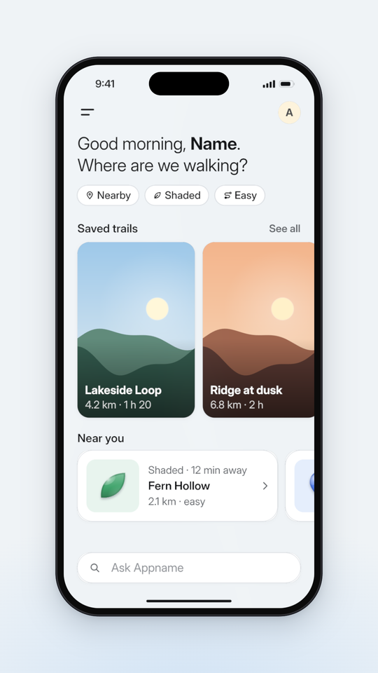
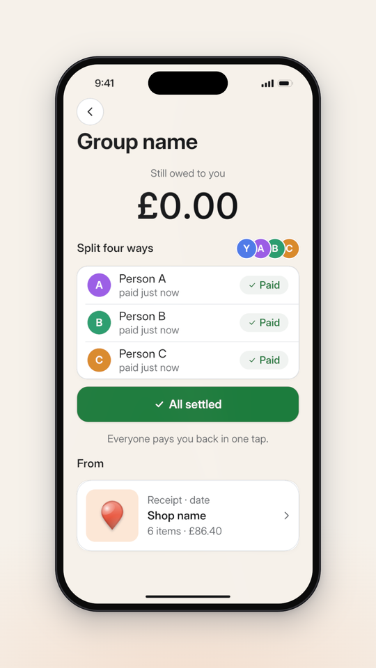
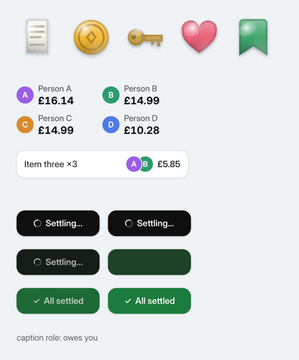

# The app kit: `components/appui.ts`

The mobile app rebuilt as canvas-drawn planes that live inside the phone's screen: a type scale in proportion to the screen, a legibility floor, a layout helper, and the components most app films need. It extends `three-assets`' drawn UI (`components/ui.ts`: `canvasPlane`, `UiTheme`, the 28 px rule) and the `three-type` kit (`label`, `measure`, `setLabel`, `counter`) rather than repeating them. The parts fewer films need (a chat turn, share-sheet rows, a library card, a detail hero, step lists, a camera scanner) are a second module, `components/appmore.ts`, in `references/ui-kit-more.md`.

Tested by rendering: compiled with strict TypeScript against `three` r185 and captured at 1080 × 1920 inside `components/phone.ts`. `images/home.png` is §3's page, `images/settle.png` §4's state change, `images/kit.png` components on the stage (the receipt, coin and key stickers beside two older ones, `balances` wrapping four people to 2 × 2, a `lineItem` with its assignees, and the button across frames 15–20 after its tap: frame 18 shows neither label).

It needs `components/stage.ts`, `components/type.ts` and `components/ui.ts`. Build everything inside `withFonts` (and `withImages` for photos): canvases drawn before the font lands are drawn in a fallback face and never redrawn.

  

Contents: 1 Rules · 2 API · 3 A full home page · 4 Rows that change state, an amount that rolls, a touch · 5 Real screenshots and photos · 6 Stickers · 7 The module

## 1. Rules

- **Sizes are % of the screen width S**, clamped to `floor / shown` px (28 by default); the roles that sit on the floor (secondary, caption, chip) are drawn 2 px over it (30 px), because a 28 px caption measured about 26 px on a judged export. Pass `shown` (the smallest scale the phone is read at) and the kit enlarges small roles instead of letting them fall under the floor; then lose rows, never shrink text.
- **Containers vs components.** A `page()` (and a sheet's `panel`) has its origin at its **top-left**, y down in px. Every component has its origin at its **centre** and carries its size in `userData.wPx/hPx`, so `put(container, component, x, y)` places the component's top-left at (x, y), and `stack()` puts a column of them `gap` apart and returns the y under the last (where an inline button goes). `put` also stores `userData.rest`, the pose every flow in `flows.ts` animates from.
- **Drawn once.** Every component draws its canvas in the builder at `res` (2.2 default; 2 × the deepest push). Per frame you only move, scale, tint and fade. A state change is planes crossfaded (radio on/off, a row's states, sheet titles) or one white plane re-tinted (the button), never a redraw.
- **One element per plane when it moves on its own**: chips in a row, list controls, each avatar dot, each follow-up, each word of a streamed answer.
- **`fade(obj, o)` or `setLabel`, not both on one plane**: `fade` remembers each material's first opacity and scales it; it works on canvas planes, counters and type-kit labels alike. Fading a parent overwrites what its children animate, so to hide a whole page or turn, leave it out of `ph.render`'s list instead.
- **Colours are `#rrggbb`** in the theme: the kit mixes them. One accent; `selected` (checks and radios that are on) is ink by default, never the brand accent, because a coral or red check reads as an error; `success` is for a completed step only. The button's idle → success ramp is mixed in OKLCH with a lighter middle (coral → orange → gold → green), because two opaque planes crossfaded in sRGB pass through brown when the hues are far apart.
- **A page entering on a cut is ≥ 80% built on its first frame**: `pageIn(key, frame, cut)` from `flows.ts` staggers only the 2–4 blocks that matter; the rest is there. Staggering a 20-block page 2f apart left a judged film's cut frame blank.
- **Placeholder art is deterministic**: `scenery`, `blobs`, `tile` and `paper` are fixed drawings (no randomness), so every render is identical.
- **Every sample string is a placeholder.** The app name ("Appname"), people ("Person A", "Person B"), shops ("Shop name"), items ("Item one") and amounts in these scenes are stand-ins, deliberately generic: replace every one with the brief's own world (its product, its users' names, its items and currency) before the first capture. Films that kept the samples looked like each other.
- **Illustrative UI is labelled.** Rebuilt chrome in the brand's colours goes in `VIDEO.md` under "I assumed": "illustrative UI, replace with real screens".

## 2. API

| Call | Gives | Notes |
| --- | --- | --- |
| `appKit(spec, theme?, { shown, floor, res })` | the kit `k` | `spec` is `ph.spec` (or `phoneSpec(W)` for UI on the stage). `k.type`, `k.sp`, `k.rad`, `k.pct(p)` are the scale, spacing, radii and `p`% of S; `k.plane`, `k.card`, `k.roundPath`, `k.hairline` draw your own |
| `k.page(name, bg?, ink?)` | container | Full screen; `bg` a colour (a flat plane, no canvas) or `Art`; `ink` "light" for dark pages (status bar turns white) |
| `k.put(parent, c, x, y, z?)`, `k.stack(parent, items, x, y, gap?)` | `c` / the y under the last | Place by top-left px; a column with gaps (an inline button under a list) |
| `k.navBar(title?, left?, right?)` | plane | Menu or back circle (with a hairline), avatar initial, large title (8.8% S, 700) |
| `k.greeting(lines)`, `k.section(title, link?)` | plane | 7% S lh 1.24 with `**bold**` runs; 4.6% S semibold header with an optional muted link |
| `k.textBlock(s, size?, weight?, color?, w?, align?)` | plane | Wrapped text as one plane; `align` "left", "center" or "right" (amounts, a right column) |
| `k.chip(label, icon?, tint?)`, `k.chipRow(parent, items, x, y)` | plane(s) | White pill, hairline, line icon; tint for the selected one |
| `k.imageCard(w, h, art, title, sub?)` | plane | Art fills, bottom 45% darkens to 55% black, white title and caption inset 3.1% S |
| `k.rowCard(w, art, kicker, title, meta)` | plane | Horizontal card: thumbnail tile, three lines, chevron |
| `k.listGroup(w, rows)` | `{ group, controls[], rowH }` | Rows 15% S tall; `control: "radio"` rows get `{ on, off }` planes to crossfade (3f); "on" is `T.selected` |
| `k.stateList(w, rows)` | `{ group, set(row, s), rowH }` | Rows whose sub line and right side (an amount, or a pill) change per frame: `set(1, 0.5)` is row 2 halfway from state 0 to 1. Optional round `lead` art per row |
| `k.pill(text, tone?)` | plane | Status capsule: "success" (tinted green, check), "pending" (amber, clock), "neutral" |
| `k.dots(people, d?)` | `{ group, items[] }` | Small overlapping avatar dots with initials (≥ 28 px glyphs), one plane each so they pop in one by one |
| `k.counter(pattern, size?, { weight, color, font, anchor })` | three-type counter, boxed | An amount that rolls and goes through `put()`: the box is the whole pattern, the visible number is centred (or `anchor` "right" for a right column). Uses tabular figures when the font has them |
| `k.input(w, placeholder, query, { icon, send })` | `{ group, set(chars, caret?, active?), height }` | Types `query` by revealing it; caret rides the reveal; with `send`, the circle turns active while typing |
| `k.stateButton(w, { idle, loading, done })` | `{ group, set({ press, loading, done, spin }), height }` | Rounded rectangle (radius 4.5% S), not a pill; one white plane tinted `mixOklch(primary, success, done)`; pose it with `buttonPose` |
| `k.tapMark(d?)` | `{ group, dot, ring }` | A touch: put its box centred on the control, pose it with `tapPose` on the press frame |
| `k.sheet(top, { bg, handle, title, sub, close, scrim })` | `{ group, panel, scrim, top, contentY }` | `panel` is a container; it reaches past the screen bottom so no gap shows mid-slide; the scrim is the theme's ink (pass a warm dark on a warm ground) and stays at 0 unless `sheetPose` is given `scrim` |
| `k.toast(app, [line1, line2], tileArt, when?)` | plane | Frosted banner, inset 2.7% S, top at 15% S (safe in a feed); like a real notification it covers the header while it shows |
| `k.pillToast(msg)` | plane | Dark pill with a green check. **The pill and the header are designed together**: it takes the header's slot (`y = k.sp.header − h / 2`, centred on the header row) while the header fades out under it (`pillSwap` in `flows.ts`), or, when the header must stay, it sits under it at 27% S over content that can be covered for its hold. Never on top of a visible app name or header icon. Bottom centre (0.31 S above the screen bottom) only when the device is whole on screen and nothing covers it |
| `k.scrollEdge()` | plane | The page colour fading out under the status bar; put it above content that scrolls |
| `fade(obj, o)`, `mixOklch(a, b, t)`, `rgba(c, a)`, `box(o, w, h)` | — | Opacity for planes, counters and labels; a perceptual colour mix; a tinted fill; give your own group a size for `put()` |
| `icon(g, kind, cx, cy, size, color)`, `text(g, s, x, y, size, weight, color, align?)`, `wrap(...)`, `fit(...)`, `shade(c, t)` | — | Drawing helpers for your own components |
| `scenery`, `blobs`, `tile`, `photo` | `Art` | Placeholder landscape, colour fields, pastel tile with a sticker, a loaded image cover-fitted |
| `withImages(ctx, urls, build)` | update | Load images through `ctx.manager`, then build |
| `sticker(kind, size, hue)`, `drawSticker(g, …)` | plane | Glossy original stickers: bubble, heart, spark, bolt, leaf, pin, flag, ribbon, receipt, coin, key |
| `moreKit(k)` (`components/appmore.ts`) | more parts | `avatarRow`, `actions`, `bubble`, `answer`, `resultRow`, `followUp`, `collection`, `hero`, `steps`, `scanner`, and `paper` art: `references/ui-kit-more.md` |

## 3. A full home page

At the measured rest framing (W 765, centred). Every block is its own plane; only the greeting, the chips and the first card build (`pageIn`), the rest is there on frame 0. The screen is filled top to bottom: greeting, chips, a carousel of tall image cards peeking off the edge, a "near you" row, the composer above the home indicator. Vertical rhythm at S = 716: header row centre 19% S, greeting from 27%, chips at 48%, section at 61.5%, cards at 70.5% (0.47 S × 0.70 S), the next section at 145%, row cards at 153.5%, the composer 10% S above the screen bottom. `images/home.png` is frame 20.

```ts
import * as THREE from "three";
import type { ThreeSceneContext, ThreeSceneUpdate } from "@genmotion/three-engine";
import interUrl from "../assets/InterVariable.woff2";
import { fitCamera } from "../components/stage";
import { withFonts } from "../components/type";
import { phone, stageBackdrop } from "../components/phone";
import { appKit, scenery, tile } from "../components/appui";
import { pageIn } from "../components/flows";

/** A home page at the measured rest framing (W 765, centred), filled top to bottom. */
export default function buildScene(ctx: ThreeSceneContext): ThreeSceneUpdate {
  fitCamera(ctx.camera, ctx.height);
  ctx.scene.background = stageBackdrop(ctx.width, ctx.height);
  return withFonts(ctx, [{ family: "Inter", url: interUrl }], () => {
    const ph = phone(ctx, { width: 765 });
    ctx.scene.add(ph.group);
    const k = appKit(ph.spec);
    const { pad } = k.sp;
    const T = k.T;
    const lake = scenery(["#9cc7e8", "#e8eef0"], "#fff6d8", ["#5f8a7a", "#2f5a4c"]);
    const dusk = scenery(["#f3b48b", "#f7dcc0"], "#fff1c9", ["#a0664f", "#5b3a33"]);
    const home = k.page("home");
    k.put(home, k.navBar(null, "menu", "A"), 0, 0);
    const greet = k.put(home, k.greeting(["Good morning, **Name**.", "Where are we walking?"]), pad, k.pct(27));
    const chips = k.chipRow(home, [{ label: "Nearby", icon: "pin" }, { label: "Shaded", icon: "leaf" }, { label: "Easy", icon: "route" }], pad, k.pct(48));
    k.put(home, k.section("Saved trails", "See all"), pad, k.pct(61.5));
    const cw = Math.round(k.S * 0.47), ch = Math.round(k.S * 0.7); // tall cards: the column reaches the composer
    const card1 = k.put(home, k.imageCard(cw, ch, lake, "Lakeside Loop", "4.2 km · 1 h 20"), pad, k.pct(70.5));
    k.put(home, k.imageCard(cw, ch, dusk, "Ridge at dusk", "6.8 km · 2 h"), pad + cw + k.pct(3.1), k.pct(70.5));
    k.put(home, k.section("Near you"), pad, k.pct(145));
    const rw = Math.round(k.S * 0.8);
    k.put(home, k.rowCard(rw, tile(T.tiles[4]!, "leaf", "#3fa36b"), "Shaded · 12 min away", "Fern Hollow", "2.1 km · easy"), pad, k.pct(153.5));
    k.put(home, k.rowCard(rw, tile(T.tiles[0]!, "pin", "#4f7be8"), "Lake · 20 min", "North Shore", "3.4 km"), pad + rw + k.pct(3.1), k.pct(153.5));
    const ask = k.input(k.Sw - pad * 2, "Ask Appname", "", { icon: "search" });
    k.put(home, ask.group, pad, k.Sh - ask.height - k.pct(10));
    ph.ui.add(home);
    const key: THREE.Object3D[] = [greet, ...chips, card1]; // only these build; the rest is there on frame 0
    return ({ frame }) => {
      pageIn(key, frame, 0);
      ph.render(home);
    };
  });
}
```

## 4. Rows that change state, an amount that rolls, a touch

The settle-up beat a judged film had to draw by hand: a touch presses the button (`tapMark` + `tapPose` on the tap frame, with a click), the button ramps coral → green through gold (never brown), and each row flips from "owes you £28.01" to a "Paid" pill half a beat apart while the amount above rolls down by exactly that row's share, so the maths is visibly right. The amount uses `k.counter` with a tabular copy of Inter, centred on the digits it shows (£0.00 sits on the screen's centre line). The lower rows carry the receipt it came from, so nothing below is empty. In a 9:16 feed cut, this whole block sits in the safe rows or is pushed into them (`SKILL.md`, the feed framing). `images/settle.png` is frame 98.

```ts
import type { ThreeSceneContext, ThreeSceneUpdate } from "@genmotion/three-engine";
import interUrl from "../assets/InterVariable.woff2";
import { fitCamera } from "../components/stage";
import { prog, inOutCubic } from "../components/ease";
import { withFonts } from "../components/type";
import { phone, punch, stageBackdrop } from "../components/phone";
import { appKit, APP_LIGHT, text, tile, type Art } from "../components/appui";
import { beatGrid, buttonPose, tapPose, popIn } from "../components/flows";

/** Rows that change state, a rolling amount, a coral -> green button and a touch: one settle-up beat. */
export default function buildScene(ctx: ThreeSceneContext): ThreeSceneUpdate {
  fitCamera(ctx.camera, ctx.height);
  ctx.scene.background = stageBackdrop(ctx.width, ctx.height, "#f6f1ea", "#f3dccb");
  const fonts = [{ family: "Inter", url: interUrl }, { family: "Inter Tnum", url: interUrl, features: '"tnum" 1' }];
  return withFonts(ctx, fonts, () => {
    const ph = phone(ctx, { width: 765, shadow: 1.4 }); // a warm ground swallows the default shadow
    ctx.scene.add(ph.group);
    const k = appKit(ph.spec, { ...APP_LIGHT, screen: "#f6f1ea", primary: "#e8573f", accent: "#e8573f" });
    const { pad } = k.sp;
    const face = (c: string, s: string): Art => (g, w, h) => ((g.fillStyle = c), g.fillRect(0, 0, w, h), text(g, s, w / 2, h / 2, h * 0.44, 600, "#ffffff", "center"));
    const page = k.page("settle");
    k.put(page, k.navBar("Group name", "back"), 0, 0);
    k.put(page, k.textBlock("Still owed to you", k.type.sub, 400, k.T.muted, k.Sw - pad * 2, "center"), pad, k.pct(41));
    const owed = k.counter("£##.##", 104, { font: '"Inter Tnum"' }); // centred on the digits it shows
    k.put(page, owed.group, (k.Sw - owed.group.userData.wPx) / 2, k.pct(48));
    k.put(page, k.section("Split four ways"), pad, k.pct(70));
    const who = k.dots([{ initial: "Y", color: "#4f7be8" }, { initial: "A", color: "#9b5de5" }, { initial: "B", color: "#2a9d6f" }, { initial: "C", color: "#d98a2b" }]);
    k.put(page, who.group, k.Sw - pad - who.group.userData.wPx, k.pct(70));
    const amounts = [28.01, 18.61, 17.36];
    const list = k.stateList(k.Sw - pad * 2, [
      { title: "Person A", lead: face("#9b5de5", "A"), states: [{ sub: "owes you", right: "£28.01" }, { sub: "paid just now", pill: "Paid" }] },
      { title: "Person B", lead: face("#2a9d6f", "B"), states: [{ sub: "owes you", right: "£18.61" }, { sub: "paid just now", pill: "Paid" }] },
      { title: "Person C", lead: face("#d98a2b", "C"), states: [{ sub: "request seen", pill: "Pending", tone: "pending" }, { sub: "paid just now", pill: "Paid" }] },
    ]);
    const btn = k.stateButton(k.Sw - pad * 2, { idle: "Request £63.98", loading: "Sending…", done: "All settled" });
    const below = k.stack(page, [list.group, btn.group], pad, k.pct(81));
    const tap = k.tapMark();
    k.put(page, tap.group, (k.Sw - tap.group.userData.wPx) / 2, below - btn.height / 2 - tap.group.userData.hPx / 2, 0.05);
    const note = k.textBlock("Everyone pays you back in one tap.", k.type.caption, 400, k.T.muted, k.Sw - pad * 2, "center");
    k.put(page, note, pad, below + k.pct(4));
    // the lower rows: the receipt it came from, so the screen is filled to the home indicator
    k.stack(page, [k.section("From"), k.rowCard(k.Sw - pad * 2, tile(k.T.tiles[1]!, "pin", "#e8573f"), "Receipt · date", "Shop name", "6 items · £86.40")], pad, below + k.pct(13));
    ph.ui.add(page);

    const grid = beatGrid(120, ctx.fps, 0);
    const TAP = grid.bar(1) - 20; // buttonPose: success lands 20f after the tap, on the bar
    const flips = [grid.beat(4) + 8, grid.beat(5), grid.beat(5) + 8]; // half a beat apart, after the request lands
    return ({ frame }) => {
      ph.group.scale.setScalar(1 + punch(frame, [grid.bar(1)]));
      tapPose(tap, frame, TAP);
      buttonPose(btn, frame, TAP); // idle coral -> success green, mixed in OKLCH
      let left = 63.98;
      flips.forEach((f, i) => {
        const p = prog(frame, f, 8, inOutCubic);
        list.set(i, p); // the row's sub and right side crossfade to "Paid"
        left -= amounts[i]! * p;
      });
      owed.set(Math.max(0, Math.round(left * 100) / 100));
      popIn(note, frame, flips[2]! + 8);
      ph.render(page);
    };
  });
}
```

## 5. Real screenshots and photos

```ts
import shotUrl from "../assets/home-screen.png";
import photoUrl from "../assets/trail.jpg";
// builder
return withFonts(ctx, fonts, () => withImages(ctx, [shotUrl, photoUrl], ([shot, pic]) => {
  const k = appKit(ph.spec);
  const home = k.page("home", shot ? photo(shot) : k.T.screen);  // the screenshot is the page
  ph.set({ status: false });                                       // it carries its own status bar
  const card = k.imageCard(337, 400, pic ? photo(pic) : lake, "Lakeside Loop");
  // ...
  return ({ frame }) => { /* ... */ ph.render(home); };
}));
```

- A screenshot used as a page must have the screen's aspect (`Sw / Sh` ≈ 0.462 portrait): crop it with `ffmpeg` first; `photo()` cover-fits and would cut a mismatched one.
- Re-draw over a screenshot only to animate a part of it (a button changing state): put the drawn component exactly over the screenshot's control.
- A failed image arrives as `undefined`: fall back to placeholder art so the frame is never blank.


## 6. Stickers

Original, procedural, glossy: each is a simple path (a speech bubble, a heart, a four-point spark, a bolt, a leaf, a map pin, a flag, a ribbon, a receipt with a torn edge, a coin, a key) filled with a top-light gradient, a darker inner rim, a soft bounce light at the bottom right, a specular highlight at the top left and a soft drop shadow; the receipt, the coin and the key carry an engraved detail (printed lines, an inner rim, a bow hole) in a darker shade of their hue. They are not copies of any emoji set: never trace or import one. Choose the sticker that matches the shot (a ribbon on save, a bubble on a message, a spark on an AI answer, a receipt on a scan, a coin on a payment, a key on a sign-in or an unlock) and its hue from the film's palette. Motion: `stickerPose` in `flows.ts`.

## 7. The module

Copy it whole into `components/appui.ts`.

```ts
import * as THREE from "three";
import type { ThreeFrame, ThreeSceneContext, ThreeSceneUpdate } from "@genmotion/three-engine";
import { PX } from "./stage";
import { FONT, counter, hasTabularFigures, label, measure, setLabel, slug, type Label } from "./type";
import { canvasPlane, type Flat, type UiTheme } from "./ui";

type G = OffscreenCanvasRenderingContext2D;
/** Anything that paints a w x h rectangle: placeholder art, a loaded photo, a tile with a sticker. */
export type Art = (g: G, w: number, h: number) => void;

export interface AppTheme extends UiTheme {
  sheet: string; // modal sheets (warm off-white)
  primary: string; // primary button at rest
  onPrimary: string;
  success: string; // a step that completed, and nothing else
  selected: string; // checks and radios that are on: ink by default, never the brand accent (a coral check reads as an error)
  frost: string; // notification banner fill
  tiles: string[]; // pastel grounds behind stickers and thumbnails
}

export const APP_LIGHT: AppTheme = {
  screen: "#eff3f6", surface: "#ffffff", text: "#0d0f12", muted: "#62666b",
  accent: "#2e5be6", onAccent: "#ffffff", line: "#e3e6ea",
  sheet: "#fbfbf8", primary: "#0f0f0f", onPrimary: "#ffffff", success: "#1c7c3d", selected: "#0f0f0f",
  frost: "rgba(243,241,242,0.97)",
  tiles: ["#e5eefc", "#fce7d6", "#eee9f8", "#fdf3dc", "#e8f4ee", "#fbe6ee"],
};

/* ------------------------------------------------------------- drawing */

const TAU = Math.PI * 2;

function font(g: G, size: number, weight: number) {
  g.font = `${weight} ${size}px ${FONT}`;
  g.letterSpacing = size >= 44 ? `${-0.015 * size}px` : "0px";
}

/** One line of text; returns its advance. `**bold**` runs inside it are drawn at 700. */
export function text(g: G, s: string, x: number, y: number, size: number, weight: number, color: string, align: CanvasTextAlign = "left"): number {
  g.fillStyle = color;
  g.textBaseline = "middle";
  const runs = s.split("**");
  const widths = runs.map((r, i) => (font(g, size, i % 2 ? 700 : weight), g.measureText(r).width));
  const total = widths.reduce((a, b) => a + b, 0);
  let cx = align === "center" ? x - total / 2 : align === "right" ? x - total : x;
  g.textAlign = "left";
  runs.forEach((r, i) => {
    font(g, size, i % 2 ? 700 : weight);
    g.fillText(r, cx, y + size * 0.04);
    cx += widths[i]!;
  });
  return total;
}

/** Cut a string to fit `maxW` with an ellipsis. */
export function fit(g: G, s: string, maxW: number, size: number, weight: number): string {
  font(g, size, weight);
  if (g.measureText(s).width <= maxW) return s;
  let t = s;
  while (t.length > 1 && g.measureText(`${t}…`).width > maxW) t = t.slice(0, -1);
  return `${t.trimEnd()}…`;
}

/** Original line icons on a 24-unit grid (stroke 2). An "F" prefix fills instead of stroking. */
export const ICONS: Record<string, string> = {
  search: "M10.5 4a6.5 6.5 0 1 1 0 13a6.5 6.5 0 1 1 0-13M15.5 15.5L20.5 20.5",
  plus: "M12 5V19M5 12H19",
  back: "M15 5L8 12L15 19",
  chevron: "M9 5L16 12L9 19",
  close: "M6 6L18 18M18 6L6 18",
  menu: "M4 8H20M4 15H14",
  check: "M5 12.5L10 17L19 7",
  mic: "M9 6a3 3 0 0 1 6 0V11a3 3 0 0 1-6 0ZM6 11a6 6 0 0 0 12 0M12 17V21",
  up: "M12 19V5M6 11L12 5L18 11",
  share: "M12 15V3M7.5 7.5L12 3L16.5 7.5M8 11H6V21H18V11H16",
  bookmark: "M7 3H17V21L12 16.5L7 21Z",
  folder: "M3 6.5H9.5L11.5 8.5H21V19H3Z",
  heart: "M12 20C5 15 3 11.5 3 8.5A4.5 4.5 0 0 1 12 6.5A4.5 4.5 0 0 1 21 8.5C21 11.5 19 15 12 20Z",
  clock: "M12 3a9 9 0 1 1 0 18a9 9 0 1 1 0-18M12 7.5V12L15 14",
  pin: "M12 21C7.5 15.5 5.5 12.5 5.5 9.5A6.5 6.5 0 0 1 18.5 9.5C18.5 12.5 16.5 15.5 12 21ZM12 7.5a2 2 0 1 1 0 4a2 2 0 1 1 0-4",
  leaf: "M5 19C5 10 10 5 19 5C19 14 14 19 5 19ZM5 19L13 11",
  route: "M6 18a2 2 0 1 1 0 .1M18 6a2 2 0 1 1 0 .1M8 18H15a3 3 0 0 0 0-6H9a3 3 0 0 1 0-6H16",
  sliders: "M4 7H14M18 7H20M4 17H6M10 17H20M16 5V9M8 15V19",
  reply: "M5 4V12H18M14 8L18 12L14 16",
  copy: "M8 8H19V19H8ZM5 15V5H15",
  more: "F M5 10.5a1.5 1.5 0 1 1 0 3a1.5 1.5 0 1 1 0-3M12 10.5a1.5 1.5 0 1 1 0 3a1.5 1.5 0 1 1 0-3M19 10.5a1.5 1.5 0 1 1 0 3a1.5 1.5 0 1 1 0-3",
  spark: "F M12 2.5Q13.2 10.8 21.5 12Q13.2 13.2 12 21.5Q10.8 13.2 2.5 12Q10.8 10.8 12 2.5Z",
};

export function icon(g: G, kind: keyof typeof ICONS | string, cx: number, cy: number, size: number, color: string, weight = 2) {
  const d = ICONS[kind];
  if (!d) return;
  g.save();
  g.translate(cx - size / 2, cy - size / 2);
  g.scale(size / 24, size / 24);
  g.lineWidth = weight;
  g.lineCap = "round";
  g.lineJoin = "round";
  g.strokeStyle = g.fillStyle = color;
  if (d.startsWith("F")) g.fill(new Path2D(d.slice(1)));
  else g.stroke(new Path2D(d));
  g.restore();
}

/** "#rrggbb" to [r, g, b] 0-255. Give theme colours as #rrggbb: the kit mixes them. */
export const hex = (c: string) => {
  const n = parseInt(c.replace("#", ""), 16);
  return [(n >> 16) & 255, (n >> 8) & 255, n & 255];
};
/** A #rrggbb colour at alpha a, for tinted fills (a pill's ground). */
export const rgba = (c: string, a: number) => `rgba(${hex(c).join(",")},${a})`;

/** sRGB #rrggbb to OKLCH [L, C, hue in radians]. */
function oklch(c: string): [number, number, number] {
  const [r, g, b] = hex(c).map((v) => ((v /= 255) <= 0.04045 ? v / 12.92 : ((v + 0.055) / 1.055) ** 2.4)) as [number, number, number];
  const l = Math.cbrt(0.4122214708 * r + 0.5363325363 * g + 0.0514459929 * b);
  const m = Math.cbrt(0.2119034982 * r + 0.6806995451 * g + 0.1073969566 * b);
  const s = Math.cbrt(0.0883024619 * r + 0.2817188376 * g + 0.6299787005 * b);
  const A = 1.9779984951 * l - 2.428592205 * m + 0.4505937099 * s;
  const B = 0.0259040371 * l + 0.7827717662 * m - 0.808675766 * s;
  return [0.2104542553 * l + 0.793617785 * m - 0.0040720468 * s, Math.hypot(A, B), Math.atan2(B, A)];
}

/**
 * Mix two #rrggbb colours in OKLCH (lightness, chroma, hue on the short arc), so coral -> green
 * passes through clean warm hues, never the brown an sRGB crossfade of two opaque planes makes.
 * A large hue swing also lifts the middle up to +0.14 L: the in-between frames read light, not muddy.
 */
export function mixOklch(a: string, b: string, t: number): string {
  const [L1, C1, h1] = oklch(a), [L2, C2, h2] = oklch(b);
  const H1 = C1 < 0.02 ? h2 : h1, H2 = C2 < 0.02 ? H1 : h2; // a grey or black takes the other's hue
  const dh = Math.atan2(Math.sin(H2 - H1), Math.cos(H2 - H1));
  const L = L1 + (L2 - L1) * t + 0.14 * Math.min(1, Math.max(0, (Math.abs(dh) - 0.8) / 0.8)) * Math.sin(Math.PI * t);
  const C = C1 + (C2 - C1) * t, h = H1 + dh * t;
  const A = C * Math.cos(h), B = C * Math.sin(h);
  const l = (L + 0.3963377774 * A + 0.2158037573 * B) ** 3;
  const m = (L - 0.1055613458 * A - 0.0638541728 * B) ** 3;
  const s = (L - 0.0894841775 * A - 1.291485548 * B) ** 3;
  const enc = (v: number) => Math.round(255 * Math.min(1, Math.max(0, v <= 0.0031308 ? 12.92 * v : 1.055 * v ** (1 / 2.4) - 0.055)));
  return `rgb(${enc(4.0767416621 * l - 3.3077115913 * m + 0.2309699292 * s)},${enc(-1.2684380046 * l + 2.6097574011 * m - 0.3413193965 * s)},${enc(-0.0041960863 * l - 0.7034186147 * m + 1.707614701 * s)})`;
}
/** Mix a hex colour towards white (t > 0) or black (t < 0). */
export function shade(c: string, t: number): string {
  const [r, g, b] = hex(c).map((v) => Math.round(t > 0 ? v + (255 - v) * t : v * (1 + t)));
  return `rgb(${r},${g},${b})`;
}

/* ---------------------------------------------------------------- art */

/** Placeholder "photo": sky, sun, two ridges and haze. Deterministic; colours set the mood. */
export const scenery = (sky: [string, string], sun: string, ridges: [string, string]): Art => (g, w, h) => {
  const sk = g.createLinearGradient(0, 0, 0, h);
  sk.addColorStop(0, sky[0]);
  sk.addColorStop(1, sky[1]);
  g.fillStyle = sk;
  g.fillRect(0, 0, w, h);
  const sg = g.createRadialGradient(w * 0.68, h * 0.38, 0, w * 0.68, h * 0.38, w * 0.5);
  sg.addColorStop(0, sun);
  sg.addColorStop(0.18, sun);
  sg.addColorStop(0.2, "rgba(255,255,255,0.25)");
  sg.addColorStop(1, "rgba(255,255,255,0)");
  g.fillStyle = sg;
  g.fillRect(0, 0, w, h);
  ridges.forEach((c, i) => {
    const base = h * (0.58 + i * 0.14);
    g.beginPath();
    g.moveTo(0, h);
    for (let j = 0; j <= 48; j++) {
      const k = j / 48, x = k * w;
      g.lineTo(x, base - h * (0.08 + 0.04 * i) * (Math.sin(k * 5.1 + i * 2.3) * 0.6 + Math.sin(k * 11.7 + i) * 0.25 + 0.4));
    }
    g.lineTo(w, h);
    g.closePath();
    g.fillStyle = c;
    g.fill();
  });
};

/** Placeholder abstract: a ground with three large blurred colour fields. */
export const blobs = (ground: string, colors: [string, string, string]): Art => (g, w, h) => {
  g.fillStyle = ground;
  g.fillRect(0, 0, w, h);
  g.save();
  g.filter = `blur(${Math.round(Math.min(w, h) * 0.12)}px)`;
  const spots: [number, number, number][] = [[0.25, 0.3, 0.45], [0.8, 0.45, 0.4], [0.45, 0.85, 0.5]];
  spots.forEach(([x, y, r], i) => {
    g.fillStyle = colors[i]!;
    g.beginPath();
    g.arc(x * w, y * h, r * Math.min(w, h), 0, TAU);
    g.fill();
  });
  g.restore();
};

/** A loaded image (or video still) as art, cover-fitted and centred. */
export const photo = (img: CanvasImageSource & { width: number; height: number }): Art => (g, w, h) => {
  const k = Math.max(w / img.width, h / img.height);
  g.drawImage(img, (w - img.width * k) / 2, (h - img.height * k) / 2, img.width * k, img.height * k);
};

/** A pastel tile with one glossy sticker on it: thumbnails for things that have no photo. */
export const tile = (ground: string, kind: StickerKind, hue: string): Art => (g, w, h) => {
  g.fillStyle = ground;
  g.fillRect(0, 0, w, h);
  drawSticker(g, kind, w / 2, h / 2, Math.min(w, h) * 0.62, hue);
};

/**
 * Build once the images are in: loads every url through ctx.manager (the export waits), then runs
 * `build` with the images in order (a failed one is undefined: fall back to placeholder art).
 * Nest it inside withFonts so text and images are both ready before anything is drawn.
 */
export function withImages(ctx: ThreeSceneContext, urls: string[], build: (imgs: (HTMLImageElement | undefined)[]) => ThreeSceneUpdate): ThreeSceneUpdate {
  if (urls.length === 0) return build([]);
  const imgs: (HTMLImageElement | undefined)[] = [];
  let left = urls.length;
  let update: ThreeSceneUpdate | null = null;
  let last: ThreeFrame | null = null;
  const key = `images:${urls.join(",")}`;
  ctx.manager.itemStart(key);
  const done = () => {
    if (--left > 0) return;
    update = build(imgs);
    if (last) update(last);
    ctx.manager.itemEnd(key);
  };
  const loader = new THREE.ImageLoader(ctx.manager);
  urls.forEach((u, i) => loader.load(u, (img) => ((imgs[i] = img), done()), undefined, () => done()));
  return (frame) => {
    last = frame;
    update?.(frame);
  };
}

/* ------------------------------------------------------------ stickers */

export type StickerKind = "bubble" | "heart" | "spark" | "bolt" | "leaf" | "pin" | "flag" | "ribbon" | "receipt" | "coin" | "key";
const STICKERS: Record<StickerKind, string> = {
  bubble: "M20 22H80A12 12 0 0 1 92 34V62A12 12 0 0 1 80 74H44L26 88L29 74H20A12 12 0 0 1 8 62V34A12 12 0 0 1 20 22Z",
  heart: "M50 88C20 68 8 52 8 36A21 21 0 0 1 50 26A21 21 0 0 1 92 36C92 52 80 68 50 88Z",
  spark: "M50 6Q55 45 94 50Q55 55 50 94Q45 55 6 50Q45 45 50 6Z",
  bolt: "M58 6L18 56H46L40 94L82 42H54Z",
  leaf: "M14 86C10 46 36 12 88 10C90 60 58 90 14 86Z",
  pin: "M50 94C30 70 16 54 16 38A34 34 0 0 1 84 38C84 54 70 70 50 94Z",
  flag: "M20 8H28V94H20ZM28 12C46 4 62 22 84 14V54C62 62 46 44 28 52Z",
  ribbon: "M26 6H74A10 10 0 0 1 84 16V94L50 72L16 94V16A10 10 0 0 1 26 6Z",
  receipt: "M24 6H76V90L69.5 84L63 90L56.5 84L50 90L43.5 84L37 90L30.5 84L24 90Z",
  coin: "M50 8A42 42 0 1 1 50 92A42 42 0 1 1 50 8Z",
  key: "M28 30A20 20 0 1 1 28 70A20 20 0 1 1 28 30ZM44 44H92V60H86V72H78V60H72V68H64V60H44Z",
};
/** Engraved detail drawn on the body (strokes in a darker shade of the hue), so a receipt, a coin and a key read as things. */
const DETAIL: Partial<Record<StickerKind, { d: string; fill?: boolean }>> = {
  receipt: { d: "M34 24H66M34 37H66M34 50H58M34 68H66" },
  coin: { d: "M50 20A30 30 0 1 1 50 80A30 30 0 1 1 50 20ZM50 36L60 50L50 64L40 50Z" },
  key: { d: "M22 44A6 6 0 1 1 22 56A6 6 0 1 1 22 44Z", fill: true },
};

/** A glossy, clay-like sticker drawn from simple geometry: body gradient, inner rim, specular, shadow. */
export function drawSticker(g: G, kind: StickerKind, cx: number, cy: number, size: number, hue: string) {
  const p = new Path2D(STICKERS[kind]);
  g.save();
  g.translate(cx - size / 2, cy - size / 2);
  g.scale(size / 100, size / 100);
  g.shadowColor = "rgba(20,30,50,0.28)";
  g.shadowBlur = 8 * (size / 100) * 2;
  g.shadowOffsetY = 5 * (size / 100) * 2;
  g.fillStyle = hue;
  g.fill(p);
  g.shadowColor = "transparent";
  const body = g.createLinearGradient(0, 8, 0, 92);
  body.addColorStop(0, shade(hue, 0.35));
  body.addColorStop(0.55, hue);
  body.addColorStop(1, shade(hue, -0.28));
  g.fillStyle = body;
  g.fill(p);
  g.clip(p);
  g.lineWidth = 9;
  g.strokeStyle = shade(hue, -0.35);
  g.globalAlpha = 0.35;
  g.stroke(p); // inner rim: half the stroke falls inside the clip
  g.globalAlpha = 1;
  const det = DETAIL[kind];
  if (det) {
    const dp = new Path2D(det.d);
    g.strokeStyle = g.fillStyle = shade(hue, -0.42);
    g.globalAlpha = 0.6;
    g.lineWidth = 5;
    g.lineCap = "round";
    if (det.fill) g.fill(dp);
    else g.stroke(dp);
    g.globalAlpha = 1;
  }
  const bounce = g.createRadialGradient(72, 86, 0, 72, 86, 40);
  bounce.addColorStop(0, "rgba(255,255,255,0.28)");
  bounce.addColorStop(1, "rgba(255,255,255,0)");
  g.fillStyle = bounce;
  g.fillRect(0, 0, 100, 100);
  const spec = g.createRadialGradient(34, 28, 0, 34, 28, 30);
  spec.addColorStop(0, "rgba(255,255,255,0.9)");
  spec.addColorStop(0.35, "rgba(255,255,255,0.35)");
  spec.addColorStop(1, "rgba(255,255,255,0)");
  g.fillStyle = spec;
  g.beginPath();
  g.ellipse(36, 30, 24, 15, -0.5, 0, TAU);
  g.fill();
  g.restore();
}

/* ------------------------------------------------------------- the kit */

export interface KitOptions {
  shown?: number; // the phone's smallest on-screen scale while this UI is read (0.6 in a wide shot)
  floor?: number; // minimum on-screen text size in composition px (feeds: 28)
  res?: number; // canvas px per composition px: 2 x the largest zoom the screen sees
}

/** Fade anything this kit (or the type kit) made: canvas planes and labels alike. */
export function fade(obj: THREE.Object3D, o: number) {
  obj.traverse((n) => {
    const m = (n as THREE.Mesh).material as THREE.Material | undefined;
    if (!m) return;
    const u = (m as THREE.ShaderMaterial).uniforms;
    n.userData.op0 ??= u?.uOpacity ? u.uOpacity.value : m.opacity;
    if (u?.uOpacity) u.uOpacity.value = n.userData.op0 * o;
    else m.opacity = n.userData.op0 * o;
  });
  obj.visible = o > 0.001;
}

/** Size an object for put(): the box it occupies, in px. Groups need it set once. */
export const box = <O extends THREE.Object3D>(o: O, w: number, h: number) => ((o.userData.wPx = w), (o.userData.hPx = h), o);

/**
 * The app kit for one screen: a type scale and spacing in proportion to the screen width S, with a
 * floor so no glyph is ever below `floor` px on screen; components drawn once at `res`.
 * Containers (pages, sheet panels) have their origin at their TOP-LEFT and y grows down in px;
 * components have their origin at their centre and carry their size, so put(c, x, y) places a
 * component's top-left corner at (x, y) inside a container.
 */
export function appKit(screen: { Sw: number; Sh: number }, theme: AppTheme = APP_LIGHT, o: KitOptions = {}) {
  const { Sw, Sh } = screen;
  const S = Sw;
  const T = theme;
  const res = o.res ?? 2.2;
  const floor = (o.floor ?? 28) / (o.shown ?? 1);
  // the roles that sit on the floor are drawn 2 px over it: a 28 px caption measured about 26 px on an export
  const small = Math.ceil(floor + 2);
  const pct = (p: number) => Math.round((p * S) / 100);
  /** Type sizes in px: % of the screen width, never under the floor. */
  const type = {
    large: Math.max(floor, pct(8.8)), sheet: Math.max(floor, pct(6.6)), greet: Math.max(floor, pct(7.0)),
    detail: Math.max(floor, pct(6.1)), section: Math.max(floor, pct(4.6)), body: Math.max(floor, pct(4.8)),
    card: Math.max(floor, pct(4.6)), sub: Math.max(small, pct(4.2)), caption: Math.max(small, pct(3.9)),
    chip: Math.max(small, pct(4.0)),
  };
  const sp = { pad: pct(5.4), gap: pct(2.5), cardGap: pct(3.1), section: pct(8.4), header: pct(19), content: pct(30) };
  const rad = { card: pct(4.7), list: pct(6), sheet: pct(7), toast: pct(6.7), button: pct(4.5), thumb: pct(3.4) };
  const plane = (w: number, h: number, draw: (g: G, w: number, h: number) => void, name: string) => canvasPlane(w, h, draw, name, res);

  /** A plane with a soft baked shadow around a w x h card; userData keeps the card's own size. */
  function card(w: number, h: number, draw: (g: G) => void, name: string, shadow = 0.08, blur = pct(3)): Flat {
    const pad = Math.ceil(blur * 2);
    const m = plane(w + pad * 2, h + pad * 2, (g) => {
      g.translate(pad, pad);
      if (shadow > 0) {
        g.save();
        g.shadowColor = `rgba(20,30,45,${shadow})`;
        g.shadowBlur = blur;
        g.shadowOffsetY = blur * 0.35;
        g.fillStyle = "#ffffff";
        g.fill(roundPath(0, 0, w, h, Math.min(h / 2, rad.card)));
        g.restore();
      }
      draw(g);
    }, name);
    return box(m, w, h) as Flat;
  }
  const roundPath = (x: number, y: number, w: number, h: number, r: number) => {
    const p = new Path2D();
    p.roundRect(x, y, w, h, Math.min(r, w / 2, h / 2));
    return p;
  };
  const hairline = (g: G, p: Path2D) => ((g.lineWidth = 2), (g.strokeStyle = T.line), g.stroke(p));

  const kit = {
    S, Sw, Sh, T, type, sp, rad, res, floor, pct, plane, card, roundPath, hairline,

    /** A full screen: origin at the screen's top-left (add it to phone.ui). ink = status bar colour. */
    page(name: string, bg: string | Art = T.screen, ink: "dark" | "light" = "dark") {
      const g = new THREE.Group();
      g.name = name;
      g.position.set((-Sw / 2) * PX, (Sh / 2) * PX, 0);
      g.userData.ink = ink;
      const back = typeof bg === "string" // a flat colour needs no screen-sized canvas
        ? new THREE.Mesh(new THREE.PlaneGeometry(Sw * PX, Sh * PX), new THREE.MeshBasicMaterial({ color: bg, transparent: true, depthWrite: false, toneMapped: false }))
        : plane(Sw, Sh, (c, w, h) => bg(c, w, h), `${name}-bg`);
      back.name = `${name}-bg`;
      back.position.set((Sw / 2) * PX, (-Sh / 2) * PX, -0.01);
      g.add(back);
      return g;
    },

    /** Place a component's top-left at (x, y) px inside a container; z orders siblings. */
    put<O extends THREE.Object3D>(parent: THREE.Object3D, obj: O, x: number, y: number, z = 0.01): O {
      const w = obj.userData.wPx ?? 0, h = obj.userData.hPx ?? 0;
      obj.position.set((x + w / 2) * PX, -(y + h / 2) * PX, z);
      obj.userData.rest = obj.position.clone();
      parent.add(obj);
      return obj;
    },

    /** Put components in a column from (x, y), `gap` px apart; returns the y under the last one (an inline button goes there). */
    stack(parent: THREE.Object3D, items: THREE.Object3D[], x: number, y: number, gap: number = pct(3.1)) {
      let cy = y;
      for (const it of items) ((kit.put(parent, it, x, cy)), (cy += (it.userData.hPx ?? 0) + gap));
      return cy - gap;
    },

    /** Header row (menu or back, avatar or action) plus a large title: the top of most pages. */
    navBar(title: string | null, left: "menu" | "back" | null = "menu", right: string | null = null) {
      const h = title ? pct(36) : pct(25);
      return box(plane(Sw, h, (g, w) => {
        const cy = pct(19);
        if (left === "menu") icon(g, "menu", sp.pad + pct(4), cy, pct(7), T.text, 2.4);
        if (left === "back") {
          g.fillStyle = T.surface;
          const p = roundPath(sp.pad, cy - pct(5.3), pct(10.6), pct(10.6), pct(5.3));
          g.fill(p);
          hairline(g, p); // a white circle alone vanishes on a light page
          icon(g, "back", sp.pad + pct(5.3), cy, pct(5), T.text, 2.4);
        }
        if (right) {
          g.fillStyle = T.tiles[3]!;
          g.beginPath();
          g.arc(w - sp.pad - pct(4.5), cy, pct(4.5), 0, TAU);
          g.fill();
          text(g, right, w - sp.pad - pct(4.5), cy, pct(4.2), 700, shade(T.text, 0.25), "center");
        }
        if (title) text(g, title, sp.pad, pct(31), type.large, 700, T.text);
      }, `nav-${title ?? "bar"}`), Sw, h);
    },

    /** The page colour fading out under the status bar: put() it at (0, 0) above content that scrolls. */
    scrollEdge(h = pct(24)) {
      const [r, gg, b] = hex(T.screen);
      return box(plane(Sw, h, (g, w) => {
        const gr = g.createLinearGradient(0, 0, 0, h);
        gr.addColorStop(0.5, T.screen);
        gr.addColorStop(1, `rgba(${r},${gg},${b},0)`);
        g.fillStyle = gr;
        g.fillRect(0, 0, w, h);
      }, "scroll-edge"), Sw, h);
    },

    /** Wrapped text as one plane (a title that crossfades, a paragraph nobody streams); "right" for amounts. */
    textBlock(s: string, size: number = type.body, weight = 400, color: string = T.text, w = Sw - sp.pad * 2, align: "left" | "center" | "right" = "left") {
      const lh = Math.round(size * 1.3), lines = wrap(s, size, weight, w), h = lh * lines.length;
      const x = align === "center" ? w / 2 : align === "right" ? w : 0;
      return box(plane(w, h, (g) => lines.forEach((l, i) => text(g, l, x, lh * (i + 0.5), size, weight, color, align)), `text-${slug(s)}`), w, h);
    },

    /** Two-line greeting: regular weight with **bold** runs, lh 1.24. */
    greeting(lines: string[]) {
      const lh = type.greet * 1.24;
      const h = Math.ceil(lh * lines.length);
      return box(plane(Sw - sp.pad * 2, h, (g) => lines.forEach((l, i) => text(g, l, 0, lh * (i + 0.5), type.greet, 400, T.text)), "greeting"), Sw - sp.pad * 2, h);
    },

    /** A section header with an optional right-aligned link. */
    section(title: string, link?: string) {
      const h = Math.ceil(type.section * 1.6);
      return box(plane(Sw - sp.pad * 2, h, (g, w) => {
        text(g, title, 0, h / 2, type.section, 600, T.text);
        if (link) text(g, link, w, h / 2, type.caption, 600, T.muted, "right");
      }, `section-${title}`), Sw - sp.pad * 2, h);
    },

    /** One chip: white pill, hairline, optional line icon. Each chip is its own plane (stagger them). */
    chip(label: string, ic?: string, tint?: string) {
      const h = Math.max(pct(7.8), type.chip * 1.9);
      const p = new OffscreenCanvas(4, 4).getContext("2d")!;
      font(p, type.chip, 500);
      const iw = ic ? type.chip * 1.15 : 0;
      const w = Math.ceil(p.measureText(label).width + iw + pct(3.1) * 2);
      return card(w, h, (g) => {
        const r = roundPath(0, 0, w, h, h / 2);
        g.fillStyle = tint ?? T.surface;
        g.fill(r);
        hairline(g, r);
        if (ic) icon(g, ic, pct(3.1) + type.chip * 0.45, h / 2, type.chip * 0.9, T.text, 2.2);
        text(g, label, pct(3.1) + iw, h / 2, type.chip, 500, T.text);
      }, `chip-${label}`, 0.04, pct(1.2));
    },

    /** Chips laid out in a row from x = 0; returns them in order (their positions are set). */
    chipRow(parent: THREE.Object3D, items: { label: string; icon?: string; tint?: string }[], x: number, y: number) {
      let cx = x;
      return items.map((it) => {
        const c = kit.chip(it.label, it.icon, it.tint);
        kit.put(parent, c, cx, y);
        cx += c.userData.wPx + pct(2.5);
        return c;
      });
    },

    /** Image card: art fills it, bottom 45% darkens to 55% black, white title and sub inset. */
    imageCard(w: number, h: number, art: Art, title: string, sub?: string) {
      return card(w, h, (g) => {
        const r = roundPath(0, 0, w, h, rad.card);
        g.save();
        g.clip(r);
        art(g, w, h);
        const gr = g.createLinearGradient(0, h * 0.55, 0, h);
        gr.addColorStop(0, "rgba(0,0,0,0)");
        gr.addColorStop(1, "rgba(0,0,0,0.55)");
        g.fillStyle = gr;
        g.fillRect(0, h * 0.5, w, h * 0.5);
        g.restore();
        const ix = pct(3.1);
        text(g, fit(g, title, w - ix * 2, type.card, 700), ix, h - ix - (sub ? type.caption * 1.35 : 0) - type.card * 0.5, type.card, 700, "#ffffff");
        if (sub) text(g, sub, ix, h - ix - type.caption * 0.5, type.caption, 400, "rgba(255,255,255,0.82)");
      }, `card-${title}`, 0.1);
    },

    /** Horizontal list card: thumbnail tile, muted kicker, title, meta, chevron. Peeks off the edge in a row. */
    rowCard(w: number, art: Art, kicker: string, title: string, meta: string) {
      const th = pct(21);
      const h = th + pct(3.6) * 2;
      return card(w, h, (g) => {
        const r = roundPath(0, 0, w, h, rad.list);
        g.fillStyle = T.surface;
        g.fill(r);
        hairline(g, r);
        const tx = pct(3.6);
        g.save();
        g.clip(roundPath(tx, tx, th, th, pct(3.6)));
        g.translate(tx, tx);
        art(g, th, th);
        g.restore();
        const x = tx * 2 + th, mw = w - x - pct(9);
        text(g, fit(g, kicker, mw, type.caption, 400), x, h * 0.28, type.caption, 400, T.muted);
        text(g, fit(g, title, mw, type.card, 600), x, h * 0.5, type.card, 600, T.text);
        text(g, fit(g, meta, mw, type.caption, 400), x, h * 0.72, type.caption, 400, T.muted);
        icon(g, "chevron", w - pct(5), h / 2, pct(4.4), T.muted, 2.2);
      }, `row-${title}`, 0.05);
    },

    /**
     * A grouped list: white card, hairline separators, line icon, title and muted sub per row. A row's
     * trailing control is its own pair of planes (on/off) so it can change state: fade(on, p).
     */
    listGroup(w: number, rows: { title: string; sub?: string; icon?: string; control?: "radio" | "chevron" }[]) {
      const rh = pct(15);
      const h = rh * rows.length;
      const group = new THREE.Group();
      group.name = "list-group";
      box(group, w, h);
      const bg = card(w, h, (g) => {
        const r = roundPath(0, 0, w, h, pct(4.2));
        g.fillStyle = T.surface;
        g.fill(r);
        hairline(g, r);
        rows.forEach((row, i) => {
          const y = i * rh;
          if (i > 0) ((g.fillStyle = T.line), g.fillRect(pct(3.4), y, w - pct(3.4), 2));
          const x = row.icon ? pct(14) : pct(4.2);
          if (row.icon) icon(g, row.icon, pct(7), y + rh / 2, pct(5.2), T.muted, 2);
          if (row.sub) {
            text(g, row.title, x, y + rh * 0.36, type.body, 500, T.text);
            text(g, row.sub, x, y + rh * 0.68, type.caption, 400, T.muted);
          } else text(g, row.title, x, y + rh / 2, type.body, 500, T.text);
          if (row.control === "chevron") icon(g, "chevron", w - pct(6), y + rh / 2, pct(4.4), T.muted, 2.2);
        });
      }, "list-group-bg", 0.05);
      bg.position.z = 0;
      group.add(bg);
      const d = pct(6.1);
      const controls = rows.map((row, i) => {
        if (row.control !== "radio") return null;
        const cy = -(i * rh + rh / 2) + h / 2, cx = w / 2 - pct(6.3);
        const off = plane(d + 4, d + 4, (g) => {
          g.lineWidth = 2.5;
          g.strokeStyle = "#c9ccd1";
          g.beginPath();
          g.arc(d / 2 + 2, d / 2 + 2, d / 2 - 1.5, 0, TAU);
          g.stroke();
        }, `radio-off-${i + 1}`);
        const on = plane(d + 4, d + 4, (g) => {
          g.fillStyle = T.selected;
          g.beginPath();
          g.arc(d / 2 + 2, d / 2 + 2, d / 2, 0, TAU);
          g.fill();
          icon(g, "check", d / 2 + 2, d / 2 + 2, d * 0.55, "#ffffff", 3);
        }, `radio-on-${i + 1}`);
        off.position.set(cx * PX, cy * PX, 0.002);
        on.position.set(cx * PX, cy * PX, 0.003);
        group.add(off, on);
        return { on, off };
      });
      return { group, controls, rowH: rh };
    },

    /**
     * A text input (search pill or chat composer) that types: the query is one type-kit label revealed
     * by its x mask, a caret rides the reveal. set(chars) every frame; the caret shows while chars > 0 unless set(n, false).
     */
    input(w: number, placeholder: string, query: string, o: { icon?: string; send?: boolean } = {}) {
      const h = Math.max(pct(12), type.body * 2.4);
      const group = new THREE.Group();
      group.name = "input";
      box(group, w, h);
      const lead = o.icon ? pct(13.5) : pct(5);
      const bg = card(w, h, (g) => {
        const r = roundPath(0, 0, w, h, h / 2);
        g.fillStyle = T.surface;
        g.fill(r);
        hairline(g, r);
        if (o.icon) icon(g, o.icon, pct(7), h / 2, pct(4.4), T.muted, 2.2);
        if (o.send) icon(g, "mic", w - h * 1.25, h / 2, pct(4.4), T.muted, 2);
      }, "input-bg", 0.05);
      group.add(bg);
      const ph = plane(w - lead - h, h, (g, pw) => text(g, fit(g, placeholder, pw, type.body, 400), 0, h / 2, type.body, 400, "#8b8f95"), "input-placeholder");
      ph.position.set((-w / 2 + lead + (w - lead - h) / 2) * PX, 0, 0.002);
      group.add(ph);
      const q = label(query, { size: type.body, weight: 400, color: T.text, tracking: 0 }, "left") as Label;
      q.position.set((-w / 2 + lead) * PX, 0, 0.003);
      group.add(q);
      const caret = new THREE.Mesh(new THREE.PlaneGeometry(2.5 * PX, type.body * 1.15 * PX), new THREE.MeshBasicMaterial({ color: T.accent, transparent: true, toneMapped: false, depthWrite: false }));
      caret.name = "caret";
      caret.position.z = 0.004;
      group.add(caret);
      const sendD = h * 0.74;
      const sends = o.send
        ? [T.line, T.primary].map((fill, i) => {
            const m = plane(sendD, sendD, (g) => {
              g.fillStyle = fill;
              g.beginPath();
              g.arc(sendD / 2, sendD / 2, sendD / 2, 0, TAU);
              g.fill();
              icon(g, "up", sendD / 2, sendD / 2, sendD * 0.48, i ? T.onPrimary : "#a3a8b0", 2.6);
            }, i ? "send-active" : "send-idle");
            m.position.set((w / 2 - h / 2) * PX, 0, 0.002 + i * 0.001);
            group.add(m);
            return m;
          })
        : [];
      const widths = [...query].map((_, i) => measure(query.slice(0, i + 1), { size: type.body, weight: 400, tracking: 0 }));
      const v = new THREE.Vector3();
      const set = (chars: number, caretOn = chars > 0, active = chars > 0) => {
        const n = Math.max(0, Math.min(query.length, Math.floor(chars)));
        const x = n > 0 ? widths[n - 1]! : 0;
        fade(ph, n > 0 ? 0 : 1);
        group.updateWorldMatrix(true, true);
        v.set(x * PX + 0.5 * PX, 0, 0);
        q.localToWorld(v);
        setLabel(q, { maskX: v.x });
        fade(q, n > 0 ? 1 : 0);
        caret.position.x = (-w / 2 + lead + x + 2) * PX;
        caret.visible = caretOn;
        if (sends[1]) fade(sends[1], active ? 1 : 0);
      };
      set(0);
      return { group, set, height: h };
    },

    /** Primary button with idle, pressed, loading and success states (all planes drawn once). */
    stateButton(w: number, labels: { idle: string; loading: string; done: string }) {
      const h = Math.max(pct(14.2), type.body * 2.6);
      const group = new THREE.Group();
      group.name = "state-button";
      box(group, w, h);
      // one plane drawn white and tinted per frame: idle -> success is mixed in OKLCH, never crossfaded
      const bg = card(w, h, (g) => ((g.fillStyle = "#ffffff"), g.fill(roundPath(0, 0, w, h, rad.button))), "button-bg", 0.12, pct(2));
      const lw = (s: string, extra: number) => {
        const p = new OffscreenCanvas(4, 4).getContext("2d")!;
        font(p, type.body, 600);
        return p.measureText(s).width + extra;
      };
      const lab = (s: string, lead: number, name: string) => {
        const tw = lw(s, lead);
        return plane(w, h, (g) => text(g, s, (w - tw) / 2 + lead, h / 2, type.body, 600, T.onPrimary), name);
      };
      const glyph = type.body * 0.9;
      const idle = lab(labels.idle, 0, "button-label-idle");
      const loading = lab(labels.loading, glyph * 1.5, "button-label-loading");
      const done = plane(w, h, (g) => {
        const tw = lw(labels.done, glyph * 1.4);
        icon(g, "check", (w - tw) / 2 + glyph * 0.5, h / 2, glyph, T.onPrimary, 3);
        text(g, labels.done, (w - tw) / 2 + glyph * 1.4, h / 2, type.body, 600, T.onPrimary);
      }, "button-label-done");
      const sd = glyph * 1.05;
      const spinner = plane(sd, sd, (g) => {
        g.lineWidth = sd * 0.12;
        g.lineCap = "round";
        g.strokeStyle = "rgba(255,255,255,0.3)";
        g.beginPath();
        g.arc(sd / 2, sd / 2, sd * 0.4, 0, TAU);
        g.stroke();
        g.strokeStyle = T.onPrimary;
        g.beginPath();
        g.arc(sd / 2, sd / 2, sd * 0.4, -Math.PI / 2, Math.PI * 0.35);
        g.stroke();
      }, "button-spinner");
      spinner.position.set((-lw(labels.loading, glyph * 1.5) / 2 + glyph * 0.5) * PX, 0, 0.003);
      [idle, loading, done].forEach((m) => (m.position.z = 0.002));
      group.add(bg, idle, loading, done, spinner);
      /** press 0..1 (a 4% squeeze), loading 0..1, done 0..1, spin in radians (from the frame). */
      const set = (s: { press?: number; loading?: number; done?: number; spin?: number }) => {
        const p = s.press ?? 0, l = s.loading ?? 0, d = s.done ?? 0;
        group.scale.set(1 - 0.04 * p, 1 - 0.03 * p, 1);
        bg.material.color.set(mixOklch(T.primary, T.success, d));
        // the two labels never share a frame: loading is gone by the ramp's midpoint, done starts after it
        const out = Math.min(1, Math.max(0, 1 - d / 0.5)), inn = Math.min(1, Math.max(0, (d - 0.5) / 0.5));
        fade(idle, 1 - l);
        fade(loading, l * out);
        fade(spinner, l * out);
        spinner.rotation.z = -(s.spin ?? 0);
        fade(done, inn);
      };
      set({});
      return { group, set, height: h };
    },

    /**
     * A bottom sheet. `panel` is a container (origin at its top-left, put() content into it) that the
     * flow slides; `scrim` dims the page behind (opacity 0 unless sheetPose's `scrim` fades it in; the
     * reference never dims). Its colour is the theme's ink: on a warm ground pass a warm dark (`scrim`).
     */
    sheet(top: number, o: { bg?: string; handle?: boolean; title?: string; sub?: string; close?: boolean; scrim?: string } = {}) {
      const h = Sh - top + pct(10); // reaches past the screen bottom so no gap shows mid-slide
      const group = new THREE.Group();
      group.name = "sheet";
      group.position.set((-Sw / 2) * PX, (Sh / 2) * PX, 1);
      const scrim = new THREE.Mesh(new THREE.PlaneGeometry(Sw * PX, Sh * PX), new THREE.MeshBasicMaterial({ color: o.scrim ?? T.text, transparent: true, opacity: 0.25, toneMapped: false, depthWrite: false }));
      scrim.position.set((Sw / 2) * PX, (-Sh / 2) * PX, -0.01);
      scrim.name = "sheet-scrim";
      fade(scrim, 0);
      const panel = new THREE.Group();
      panel.name = "sheet-panel";
      panel.userData.top = top;
      panel.position.set(0, -top * PX, 0);
      const bg = plane(Sw, h + pct(6), (g) => {
        g.shadowColor = "rgba(15,20,30,0.12)";
        g.shadowBlur = pct(5);
        g.fillStyle = o.bg ?? T.sheet;
        g.fill(roundPath(0, pct(6), Sw, h + rad.sheet, rad.sheet));
        g.shadowColor = "transparent";
        if (o.handle) ((g.fillStyle = "#c7cad0"), g.fill(roundPath(Sw / 2 - pct(5), pct(6) + pct(2), pct(10), pct(0.8), pct(0.4))));
        if (o.close) {
          const cx = Sw - sp.pad - pct(5.9), cy = pct(6) + pct(9);
          g.fillStyle = T.surface;
          g.beginPath();
          g.arc(cx, cy, pct(5.9), 0, TAU);
          g.fill();
          g.lineWidth = 2;
          g.strokeStyle = T.line;
          g.stroke();
          icon(g, "close", cx, cy, pct(4.2), T.text, 2.4);
        }
        if (o.title) text(g, o.title, sp.pad, pct(6) + pct(18), type.sheet, 700, T.text);
        if (o.sub) text(g, o.sub, sp.pad, pct(6) + pct(26.5), type.sub, 400, T.muted);
      }, "sheet-bg");
      bg.position.set((Sw / 2) * PX, (-(h + pct(6)) / 2 + pct(6)) * PX, 0);
      panel.add(bg);
      group.add(scrim, panel);
      return { group, panel, scrim, top, contentY: o.title ? pct(o.sub ? 33 : 27) : pct(6) };
    },

    /** Notification banner under the status bar: app tile, app name, two-line body, "now". */
    toast(app: string, body: [string, string], tileArt: Art, when = "now") {
      const w = Sw - pct(2.7) * 2, h = Math.max(pct(22), type.sub * 4.6);
      return card(w, h, (g) => {
        g.fillStyle = T.frost;
        g.fill(roundPath(0, 0, w, h, rad.toast));
        const t = pct(9.8), tx = pct(3.6);
        g.save();
        g.clip(roundPath(tx, (h - t) / 2, t, t, pct(2.5)));
        g.translate(tx, (h - t) / 2);
        tileArt(g, t, t);
        g.restore();
        const x = tx * 2 + t;
        text(g, app, x, h * 0.27, type.sub, 600, T.text);
        text(g, when, w - pct(4.5), h * 0.27, type.caption, 400, T.muted, "right");
        text(g, fit(g, body[0], w - x - pct(4), type.sub, 400), x, h * 0.53, type.sub, 400, T.text);
        text(g, fit(g, body[1], w - x - pct(4), type.sub, 400), x, h * 0.77, type.sub, 400, T.text);
      }, "toast", 0.14, pct(3.5));
    },

    /**
     * Dark confirmation pill with a green check. It takes the header's slot (put it centred on the header
     * row, y = sp.header - h / 2, and fade the header out under it: pillSwap in flows.ts), or sits under the
     * header at 27% S; bottom centre only when the whole device is on screen.
     */
    pillToast(msg: string) {
      const p = new OffscreenCanvas(4, 4).getContext("2d")!;
      font(p, type.sub, 600);
      const h = Math.max(pct(10.9), type.sub * 2.4), w = Math.ceil(p.measureText(msg).width + h * 1.6);
      return card(w, h, (g) => {
        g.fillStyle = "#161616";
        g.fill(roundPath(0, 0, w, h, h / 2));
        g.fillStyle = "#34c759";
        g.beginPath();
        g.arc(h * 0.62, h / 2, h * 0.24, 0, TAU);
        g.fill();
        icon(g, "check", h * 0.62, h / 2, h * 0.3, "#ffffff", 3.2);
        text(g, msg, h * 1.05, h / 2, type.sub, 600, "#ffffff");
      }, "pill-toast", 0.2, pct(3));
    },


    /** A status capsule: "Paid" (success, with a check), "Pending" (amber, with a clock) or neutral. */
    pill(s: string, tone: "success" | "pending" | "neutral" = "success") {
      const size = type.caption, h = Math.round(size * 1.8), ic = tone === "neutral" ? null : tone === "success" ? "check" : "clock";
      const ink = tone === "success" ? T.success : tone === "pending" ? "#9a6400" : T.muted;
      const p = new OffscreenCanvas(4, 4).getContext("2d")!;
      font(p, size, 600);
      const iw = ic ? size * 1.1 : 0, w = Math.ceil(p.measureText(s).width + iw + h * 0.9);
      return box(plane(w, h, (g) => {
        g.fillStyle = tone === "neutral" ? T.line : rgba(ink, 0.13);
        g.fill(roundPath(0, 0, w, h, h / 2));
        if (ic) icon(g, ic, h * 0.45 + size * 0.4, h / 2, size * 0.8, ink, 2.6);
        text(g, s, h * 0.45 + iw, h / 2, size, 600, ink);
      }, `pill-${slug(s)}`), w, h);
    },

    /** Small overlapping avatar dots (who an item is assigned to), one plane each so they pop in one by one. */
    dots(people: { initial: string; color: string }[], d: number = Math.max(pct(7.4), floor * 2)) {
      const pitch = Math.round(d * 0.74), w = d + pitch * Math.max(0, people.length - 1);
      const group = box(new THREE.Group(), w, d);
      group.name = "dots";
      const items = people.map((p, i) => {
        const m = plane(d + 6, d + 6, (g) => {
          g.fillStyle = "#ffffff";
          g.beginPath();
          g.arc(d / 2 + 3, d / 2 + 3, d / 2 + 3, 0, TAU); // a white ring separates overlapping dots
          g.fill();
          g.fillStyle = p.color;
          g.beginPath();
          g.arc(d / 2 + 3, d / 2 + 3, d / 2, 0, TAU);
          g.fill();
          text(g, p.initial.slice(0, 1).toUpperCase(), d / 2 + 3, d / 2 + 3, d * 0.5, 600, "#ffffff", "center");
        }, `dot-${i + 1}`);
        m.position.set((-w / 2 + d / 2 + i * pitch) * PX, 0, 0.001 * (people.length - i)); // the first sits on top
        m.userData.rest = m.position.clone();
        group.add(m);
        return m;
      });
      return { group, items };
    },

    /**
     * An amount that rolls (three-type's counter) sized for put(): its box is the whole pattern and the
     * visible number sits by `anchor` ("right" for a right-aligned amount column). Tabular figures are
     * used when the font has them (load a "tnum" copy, see three-type), else each slot fits its digit.
     */
    counter(pattern: string, size: number = type.body, o: { weight?: number; color?: string; font?: string; anchor?: "center" | "left" | "right" } = {}) {
      const st = { size, weight: o.weight ?? 600, color: o.color ?? T.text, font: o.font, tracking: size >= 44 ? -0.015 : 0 };
      const c = counter(pattern, st, hasTabularFigures(st) ? "tabular" : "proportional", o.anchor ?? "center");
      box(c.group, c.width / PX, Math.ceil(size * 1.25));
      return c;
    },

    /**
     * Rows whose state changes per frame ("owes £28.01" -> "Paid") on one white card. The card, the
     * separators, the titles and any lead art are drawn once; each state of a row (a sub line, and on
     * the right an amount or a status pill) is its own group, so set(row, s) crossfades state floor(s)
     * into ceil(s) without redrawing anything.
     */
    stateList(w: number, rows: { title: string; lead?: Art; states: { sub?: string; right?: string; pill?: string; tone?: "success" | "pending" | "neutral" }[] }[]) {
      const rh = pct(15), h = rh * rows.length, ld = pct(9.5), x0 = rows.some((r) => r.lead) ? pct(4.2) + ld + pct(3.2) : pct(4.2);
      const group = box(new THREE.Group(), w, h);
      group.name = "state-list";
      group.add(card(w, h, (g) => {
        const r = roundPath(0, 0, w, h, pct(4.2));
        g.fillStyle = T.surface;
        g.fill(r);
        hairline(g, r);
        rows.forEach((row, i) => {
          if (i > 0) ((g.fillStyle = T.line), g.fillRect(pct(3.4), i * rh, w - pct(3.4), 2));
          if (row.lead) {
            g.save();
            g.beginPath();
            g.arc(pct(4.2) + ld / 2, i * rh + rh / 2, ld / 2, 0, TAU);
            g.clip();
            g.translate(pct(4.2), i * rh + (rh - ld) / 2);
            row.lead(g, ld, ld);
            g.restore();
          }
        });
      }, "state-list-bg", 0.05));
      // a plane laid out in the card's px (top-left origin) inside this centre-origin group
      const at = (m: THREE.Object3D, x: number, y: number, pw: number, ph: number, z: number) => (m.position.set((x + pw / 2 - w / 2) * PX, (h / 2 - y - ph / 2) * PX, z), m);
      const tw = w * 0.62 - x0, lh = Math.round(type.body * 1.5), sh = Math.round(type.caption * 1.5);
      const states = rows.map((row, i) => {
        const y = i * rh, two = row.states.some((s) => s.sub);
        const ty = two ? y + rh * 0.33 - lh / 2 : y + (rh - lh) / 2;
        group.add(at(plane(tw, lh, (g) => text(g, fit(g, row.title, tw, type.body, 500), 0, lh / 2, type.body, 500, T.text), `row-${slug(row.title)}`), x0, ty, tw, lh, 0.002));
        return row.states.map((st, j) => {
          const sg = new THREE.Group();
          sg.name = `row-${i + 1}-state-${j + 1}`;
          if (st.sub) sg.add(at(plane(tw, sh, (g) => text(g, fit(g, st.sub!, tw, type.caption, 400), 0, sh / 2, type.caption, 400, T.muted), "row-sub"), x0, y + rh * 0.7 - sh / 2, tw, sh, 0.003));
          if (st.pill) {
            const p = kit.pill(st.pill, st.tone);
            sg.add(at(p, w - pct(4.2) - p.userData.wPx, y + (rh - p.userData.hPx) / 2, p.userData.wPx, p.userData.hPx, 0.003));
          } else if (st.right) {
            const rw = w * 0.36;
            sg.add(at(plane(rw, lh, (g) => text(g, st.right!, rw, lh / 2, type.body, 600, T.text, "right"), "row-right"), w - pct(4.2) - rw, y + (rh - lh) / 2, rw, lh, 0.003));
          }
          group.add(sg);
          return sg;
        });
      });
      /** Row `i` showing state `s` (0, 1, 2…; 0.5 is halfway through the crossfade from 0 to 1). */
      const set = (i: number, s: number) => states[i]?.forEach((sg, j) => fade(sg, Math.max(0, 1 - Math.abs(s - j))));
      states.forEach((_, i) => set(i, 0));
      return { group, set, rowH: rh };
    },

    /** A touch: a soft dot with a ring. put() it so its box is centred on the control; pose it with tapPose(). */
    tapMark(d: number = pct(13)) {
      const group = box(new THREE.Group(), d, d);
      group.name = "tap";
      const dot = plane(d * 1.2, d * 1.2, (g) => {
        g.shadowColor = "rgba(15,20,30,0.25)";
        g.shadowBlur = d * 0.12;
        g.fillStyle = "rgba(255,255,255,0.55)";
        g.beginPath();
        g.arc(d * 0.6, d * 0.6, d / 2, 0, TAU);
        g.fill();
        g.shadowColor = "transparent";
        g.lineWidth = 2;
        g.strokeStyle = "rgba(15,20,30,0.3)";
        g.stroke();
      }, "tap-dot");
      const ring = plane(d * 2.2, d * 2.2, (g) => {
        g.lineWidth = 3;
        g.strokeStyle = "rgba(255,255,255,0.9)";
        g.beginPath();
        g.arc(d * 1.1, d * 1.1, d / 2, 0, TAU);
        g.stroke();
        g.lineWidth = 1.5;
        g.strokeStyle = "rgba(15,20,30,0.35)";
        g.beginPath();
        g.arc(d * 1.1, d * 1.1, d / 2 + 2, 0, TAU);
        g.stroke();
      }, "tap-ring");
      ring.position.z = 0.001;
      dot.position.z = 0.002;
      group.add(ring, dot);
      return { group, dot, ring };
    },
  };
  return kit;
}

/** Greedy word wrap with the kit's canvas metrics (markup kept in the output). */
export function wrap(s: string, size: number, weight: number, maxW: number): string[] {
  const p = new OffscreenCanvas(4, 4).getContext("2d")!;
  font(p, size, weight);
  const out: string[] = [];
  let cur = "";
  for (const word of s.split(" ")) {
    const next = cur ? `${cur} ${word}` : word;
    if (cur && p.measureText(next.replace(/\*\*/g, "")).width > maxW) {
      out.push(cur);
      cur = word;
    } else cur = next;
  }
  if (cur) out.push(cur);
  return out;
}

/** A sticker as its own plane (origin at its centre, room for the shadow): pop and tilt it. */
export function sticker(kind: StickerKind, size: number, hue: string, res = 2.2): Flat {
  const pad = size * 0.2;
  const m = canvasPlane(size + pad * 2, size + pad * 2, (g) => drawSticker(g, kind, pad + size / 2, pad + size / 2, size, hue), `sticker-${kind}`, res);
  m.userData.wPx = size;
  m.userData.hPx = size;
  return m;
}
```
